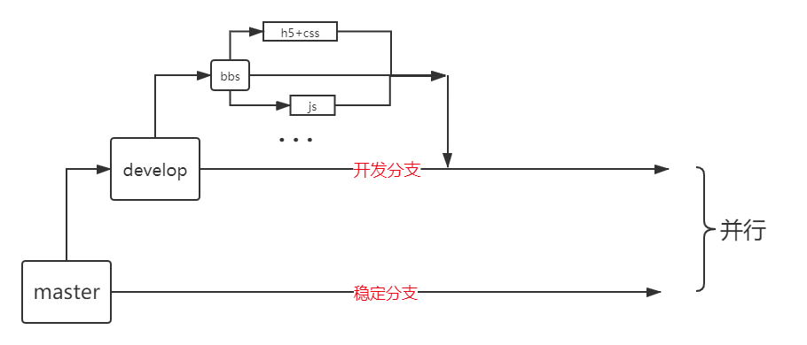
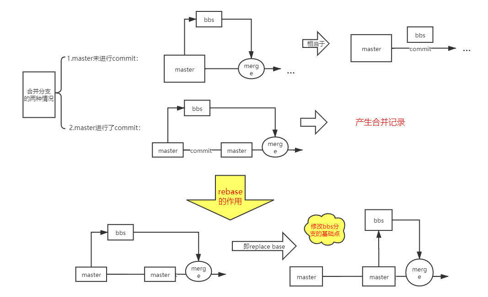

## 基本命令

```bash
git config --global #全局配置
git config #当前仓库配置
mkdir #创建文件夹
ls #列出当前目录下(文件，文件夹)
ls -a #所有all
rm -rf * #删除当前目录下所有
touch #新建文件
cat #查看文件中的内容
```

> 不想`git add . 所有？

 配置`.gitignore` 定义忽略提交的文件，其中

- 所有空行或者以注释符号 `＃` 开头的行都会被 Git 忽略。
- 匹配模式最后跟反斜杠（`/`）说明要忽略的是目录。
- 可以使用标准的 glob 模式(php)匹配。

## 从版本库删除

```bash
git rm ... #从版本库中删除，本地也会删除
git rm --cached ... #只从版本库删除 
```

## 从版本库改名

```bash
git mv ... ... #改名
```

## log

```bash
git log -p #显示文件变动信息
git log -1 #最近一次提交
git log --oneline
```

## 修改最新一次提交commit描述

```bash
git commit --amend -m "xxx" #最近一次提交的描述
```

> 也可以把最新的`git add .` 方法放到这次`commit `中

## 撤销add .

```bash
git reset HEAD a.php #文件并未被改变，只是撤销add .
```

## alias命令配置快捷操作

```bash
git config --global alias.a add #在.gitconfig中设置a表示add
atom .gitconfig #家目录执行即可看到修改后的配置  
```

## 关于分支

> 只有commit后才会有分支！！！

#### 创建分支

```bash
git branch ... #创建分支
git checkout ... #切换分支
```

```bash
git checkout -b ...#创建并切换分支
```

#### 合并分支

```bash
git merge ... #合并分支到master
```

#### 查看

```bash
git branch #所有分支
git branch --merged #已经合并的分支
git branch --no--merged #未合并的
```

> 合并产生冲突？conflict？？

手动修改冲突的文件，保留想要的内容在冲突文件中即可！然后提交

#### 删除分支

```bash
git branch -d ... #删除已经合并的分支
git branch -D ... #删除未合并的分支（慎用！写了几天的代码不要了？？）
```

#### git 标准分支工作流



#### rebase优化分支合并



```bash
git rebase master
```

**说明：** **在分支执行rebase，会将当前分支的提交紧接到master之后，然后merge，就相当于合并分支的第一种情况**

**区别：**


## 暂存区

> 当前分支还未commit不允许跳转到其他分支！可以生成暂存区解决

```bash
git stash #生成暂存区
git stash list # 暂存区列表
git stash apply... # 恢复暂存区(不填后面标识默认为恢复第0个(stash${0}))
git stash drop ... #删除暂存区
git stash pop #恢复并删除
```

## 标签

> 只有稳定代码才有资格打标签！

```bash
git tag #标签列表
git tag ...#打标签
```

## 生成代码发布压缩包

```bash
git archive master --prefix="fin/" --format=zip > fin.zip
```

**解释：** 为master分支生成名为`fin.zip`的压缩包

## SSH密钥

使用ssh连接Github发送指令更加安全可靠，也可以免掉每次输入密码的困扰。

在命令行中输入以下代码（windows用户使用 Git Bash）

```text
ssh-keygen -t rsa
```

一直按回车键直到结束。系统会在`~/.ssh` 目录中生成 `id_rsa`和`id_rsa.pub`，即密钥`id_rsa`和公钥`id_rsa.pub`。然后向GitHub添加秘钥即可。