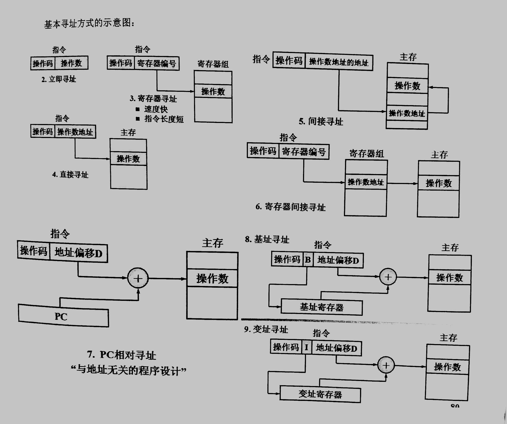
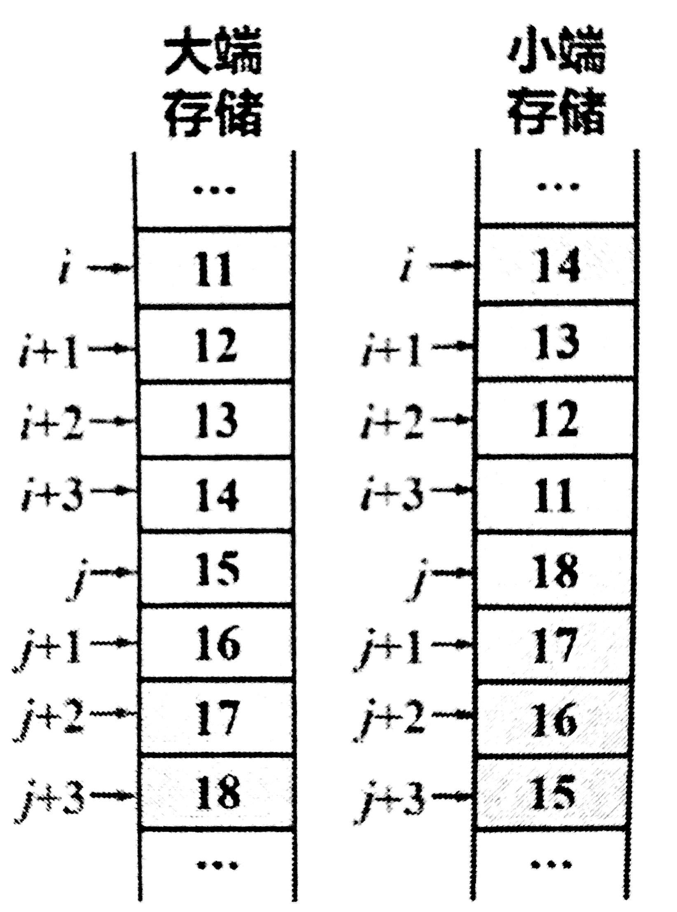
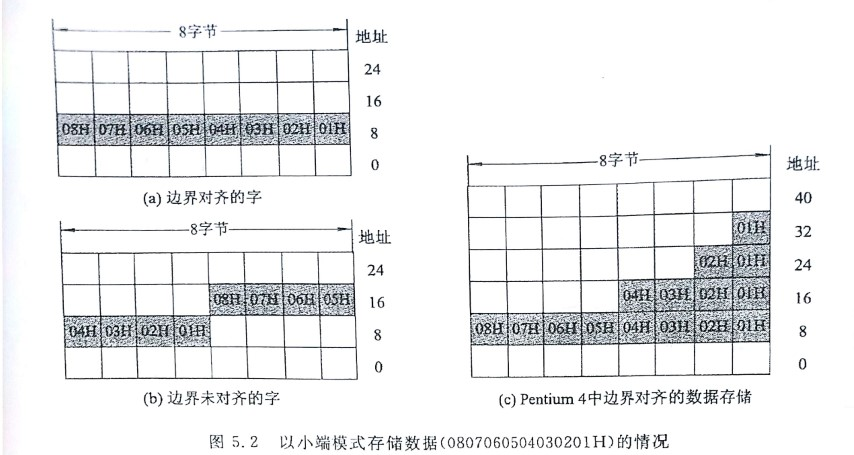
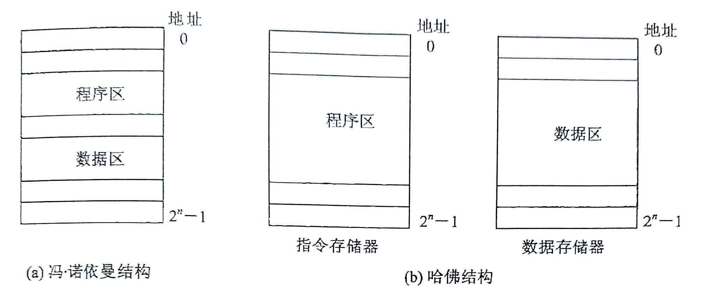

## 寻址方式

| 基本寻址方式   | 特  征                                                       | 优  点                                                     | 缺  点                               | 备  注                                               |
| -------------- | :----------------------------------------------------------- | :--------------------------------------------------------- | :----------------------------------- | ---------------------------------------------------- |
| 隐含寻址       | 操作数的存放地由操作码决定                                   |                                                            |                                      |                                                      |
| 立即寻址       | 操作数直接在指令中                                           | 加快执行速度                                               | 增加指令长度，不方便修改操作数       | 适用提供常数，设定初始值                             |
| 寄存器寻址     | 操作数在指令指定的寄存器中                                   | 方便修改，访问寄存器加快指令执行，缩短指令长度，编程更灵活 |                                      |                                                      |
| 直接寻址       | 操作数地址在指令中，操作数在主存单元中                       |                                                            | 指令字较长，不方便地址修改           |                                                      |
| 间接寻址       | 操作数地址的地址在指令中，操作数在主存中                     | 方便修改指针，编程更灵活                                   | 访问两次主存获取操作数，降低执行速度 | 形式地址，有效地址EA(=操作数地址)                    |
| 寄存器间接寻址 | 操作数地址在指令指定的寄存器中，操作数在主存单元中           | 压缩指令长度，修改寄存器内容就可以修改主存地址指针         |                                      | 方便编写循环程序                                     |
| 相对寻址       | 操作数地址由PC和指令提供的地址偏移量决定,操作数在主存单元中  |                                                            |                                      | EA=PC+D，适用与地址无关的程序设计                    |
| 基址寻址       | 操作数地址由基址寄存器(RB)和指令提供的地址偏移量决定，操作数在主存单元中 | 缩短指令长度，扩大寻址空间                                 |                                      | 大型计算机，用户的逻辑地址→主存的物理地址，EA=(RB)+D |
| 变址寻址       | 操作数地址由变址寄存器(RI)和指令提供的地址偏移量决定，操作数在主存单元中 |                                                            |                                      | 寻址到操作数RI内容(地址)自动修改，EA=(RI)+D          |
| 堆栈寻址       | 寻址方式由指令操作码决定                                     |                                                            |                                      | 适用涉及堆栈操作的指令，EA=(SP)                      |





## 存储模式

### “按字节编址”

主存将一个存储单元定为8位，即一个字节，这称为**按字节编址的存储器**

> **区分字，字节，位**
>
> - 1Byte(字节) = 8bit(位或比特)
>
> - 32位系统 ⇒ 32位为1字 ⇒由4个字节组成 ⇒ 在主存中占用4个连续的字节单元
> - 64位系统 ⇒ 64位为1字 ⇒由8个字节组成 ⇒ 在主存中占用8个连续的字节单元
> - 一般英文字母数字为1个字节，汉字为2字节(ASCII)
>   - 1.ASCII码: 一个英文字母(不分大小写)占一个字节的空间,一个中文汉字占两个字节的空间。
>   - 2.UTF-8编码: 一个英文字符等于一个字节,一个中文(含繁体)等于三个字节。中文标点占三个字节,英文标点占一个字节
>   - 3.Unicode编码: 一个英文等于两个字节,一个中文(含繁体)等于两个字节。中文标点占两个字节,英文标点占两个字节

### 数据存储顺序

**大端存储：** 数据的**最低有效字节**存储在高地址单元

**小端存储：** 数据的**最低有效字节**存储在低地址单元

对于下面这个数据结构

```c++
struct{
    double i;
    //0x1112131415161718
}
```

在主存中的大端存储和小端存储如图所示



### 边界对齐

数据存储在地位地址以全0开始的连续存储单元中，若不满足，可填充一至多个空白字节。否则，读写一个完整的数据需要访问两次存储器。



### 冯·诺依曼结构和哈佛结构

冯：指令数据混合存放在**主存**中

> 在cache中采用冯或哈不等价于主存也采用相应的结构

哈：主存分成指令地址空间和数据地址空间两部分(多见于RISC)

