## 计算※

### 数字型

#### 题型

注意“存在三条对角线的情况”，通过 **逐行相加** 的到 “三角型”计算

#### 经典例题

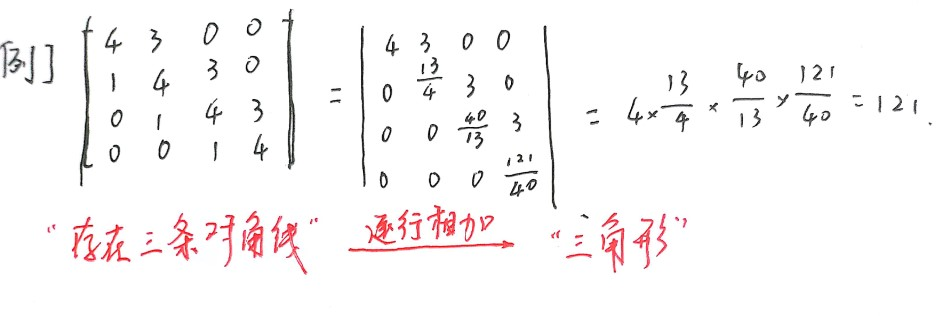

---

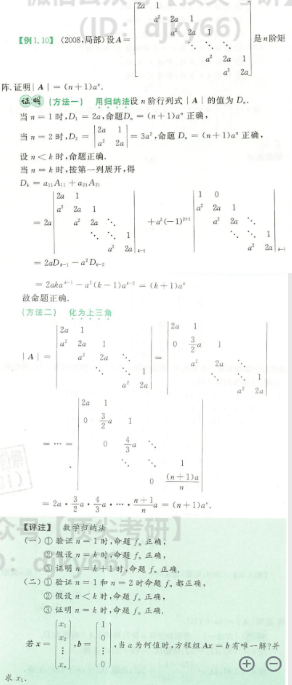

### 抽象型

#### 题型

1. 行列式性质恒等变形
2. 矩阵公式、法则恒等变形，**E恒等变形**
3. 形特征值、相似

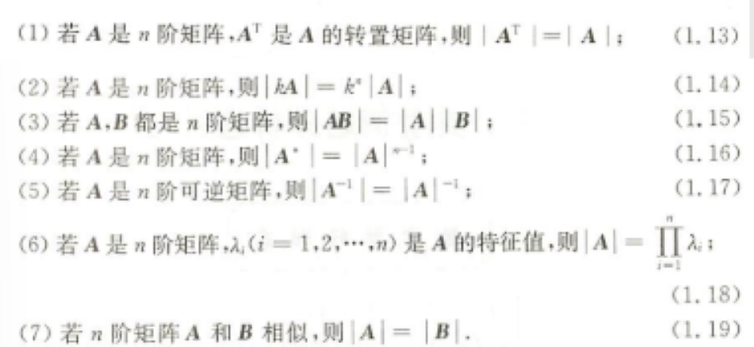

#### 经典例题

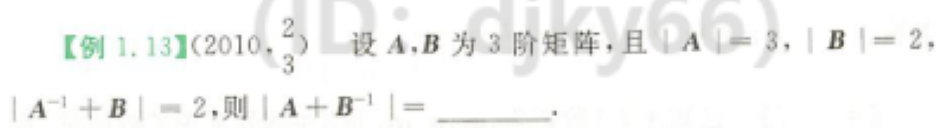

> 思路：利用单位矩阵恒等变形

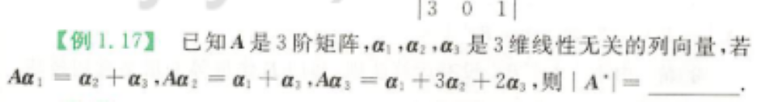

> 思路一：利用矩阵相似（$\alpha_1，\alpha_2，\alpha_3$无关，后面出现$A\alpha_1，A\alpha_2，A\alpha_3$想到相似）
>
> 利用乘法公式凑$PAP^{-1}=B$
>
> 思路二：用行列式性质

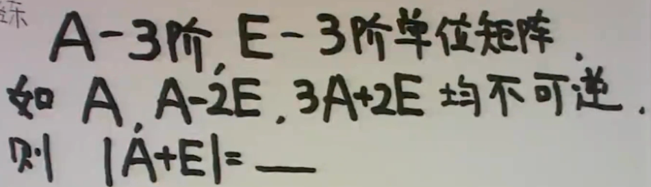

> 思路：“不可逆”=>“行列式为0”=>观察看到为特征值形式$|\lambda E-A|=0$，利用特征值与行列式的关系求解

## 应用

### 特征值

#### 思路

“消0且得公因式”

#### 例题

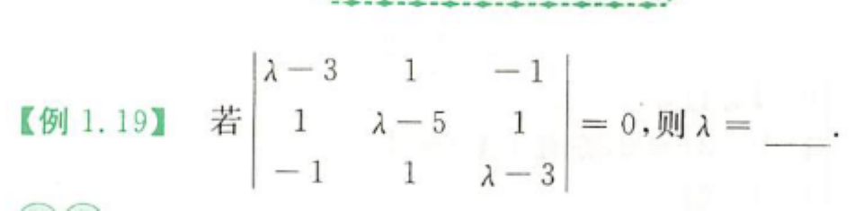

---

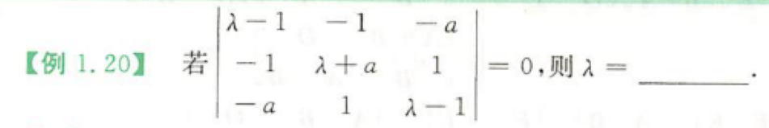

> 对于特征多项式应两行（或列）加加减减，至多是三行（或列）的加加减减找出 $\lambda-a$ 的公因式，然后再解一个二次方程，就可求出矩阵A的三个特征值

### 克拉默法则

#### 思路

> 不用来解大的方程组，常用小的证明题，
>
> - 齐次方程AX=0有非零解→ |A|=0
> - 齐次方程AX=0没有非零解→ |A|≠0

#### 经典例题

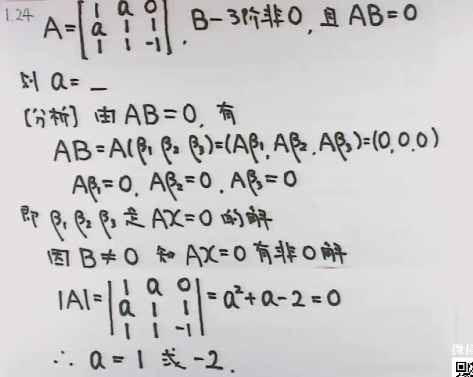

> "AB=O" 👉 方程的解(B的列向量是A的解)
>
> ​			    👉 秩 r(A)+r(B) ≤ n (n为A的列,B的行)

### 矩阵秩

#### 注意点

>r(A) =  r 👉A中有r阶子式不为0,任何r+1阶子式(若还有)必全为0.
>
>r(A) < r 👉A中每一个r阶子式全为0
>
>r(A)≥r 👉A中有r阶子式不为0.(*能确定r的范围*)
>
>A ≠ O   👉 r|A| ≥ 1
>
>A是n阶,
>
>- r(A) = n 👉 |A|≠0👉A可逆
>- r(A) < n 👉 |A| = 0👉A不可逆
>
>A是m×n矩阵,则r(A)≤min(m,n)

> "三阶矩阵r(A)=2" → |A|=0

> A — m×n ,  B — n×s  ※
>
> r(AB) ≤ min { r(A), r(B) }
>
> - 若A可逆，👉 r(AB)=r(BA)=r(B)     
> - 若A列满秩(r(A)=n)，👉 r(AB)=r(B)

## 证 |A| = 0 ？

> 构思一：证Ax=0有非零解(克拉默法则)

> 构思二：假设|A|≠0，用$A^{-1}$ 找出矛盾

> 构思三：证明 r(A) < n

> 构思四：$|A|= \Pi \lambda_i$​ (特征值)

> 构思五：证明 $|A|$ = $|A|^{-1}$

### 经典例题

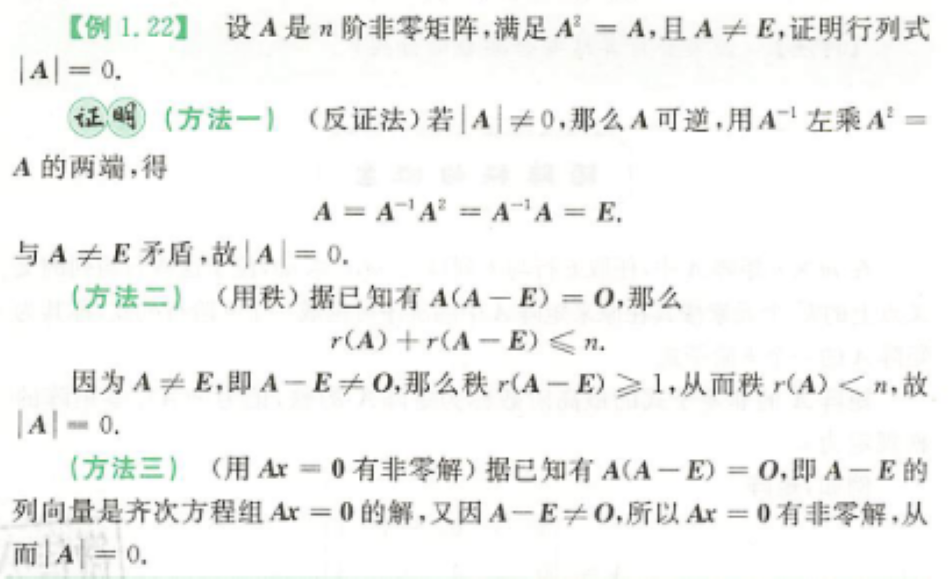

> 这里又用到了 AB=O 型！！！！

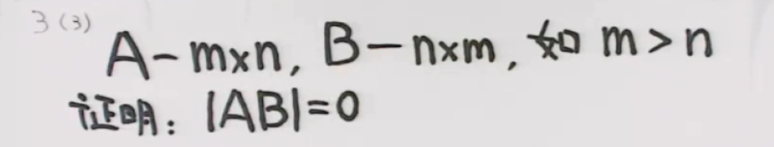

> **解法一：用秩**
>
> ​	r(AB) ≤ r(A) ≤ n < m
>
> ​	∵ AB为m阶
>
> ​	故，|AB| = 0	(  *r(AB) < m* )
>
> **解法二：用克拉默法则**
>
> ​	构造两个齐次方程组，如下：
>
> ​	ABX = 0 (1)
>
> ​	BX = 0    (2)
>
> ​	显然，(2)的解一定为(1)的解     ※
>
> ​	又∵ B为n×m，且 n < m
>
> ​	∴  BX=0 一定有非零解
>
> ​	故，ABX = 0 一定有非零解
>
> ​	|AB|=0 

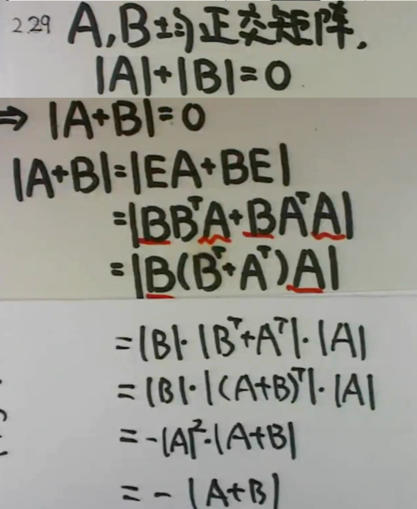

> 用到$|A|=|A|^{-1} \rightarrow |A|=0$

## 代数余子式

### 定理

> i≠j时，有：
>
> $a_{i1}A_{j1}+a_{i2}A_{j2}+...+a_{in}A_{jn}=0$
>
> $a_{1j}A_{1k}+a_{2j}A_{2k}+...+a_{nj}A_{nk}=0$​
>
> 某一行元素与另一行对应余子式乘积和为0（第j行与第i行的元素完全相同，故行列式为0）

> $A_{ij}$元素大小与$a_{ij}$无关，可构造以$A_{ij}$元素系数为一行(列)的向量，则该构造的向量按$A_{ij}$​元素系数一行(列)的展开的行列式的值就为$\sum A_{ij}$的值

#### 例题

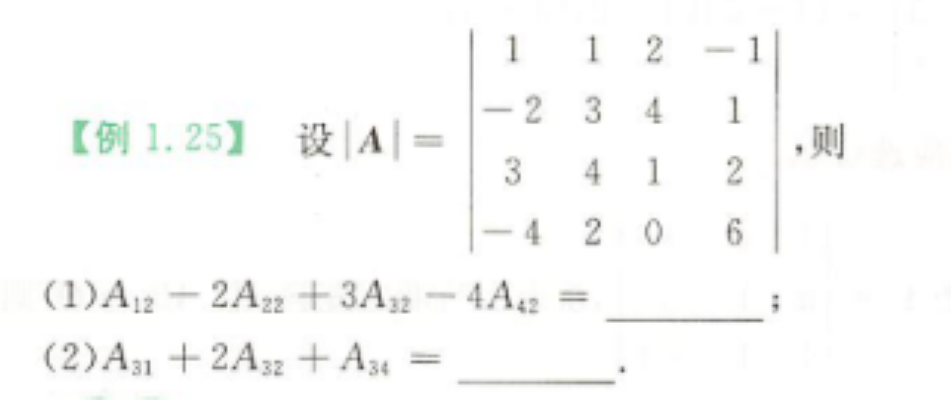

解答如下：

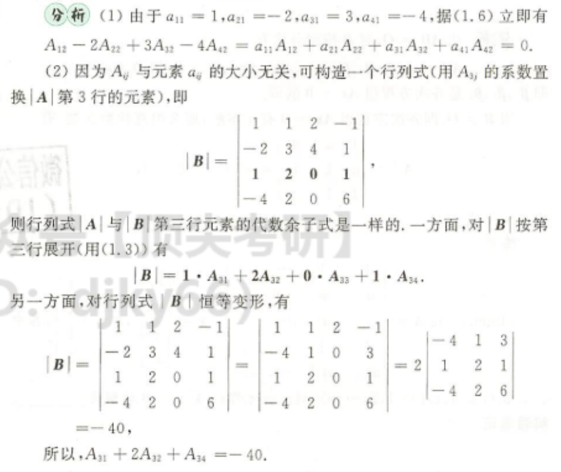

### 真题

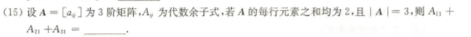

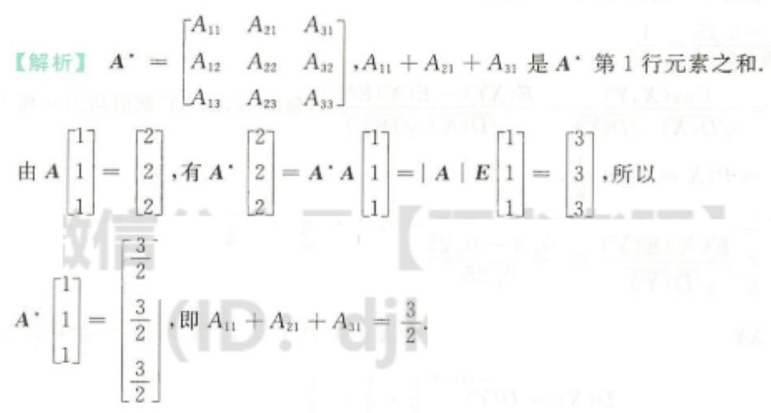

