## 基本计算

> 对角矩阵存在交换律，即 $\bigwedge_1 \bigwedge_2=\bigwedge_2 \bigwedge_1$​

> 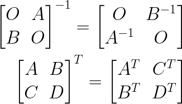
>
> 注意交换位置

### 对于 AB=C

1. B & C均按列分块，则$A(\beta_1 \beta_2 \beta_3)=(\gamma_1 \gamma_2 \gamma_3)$，故B**的列向量都是$AX=\gamma$  的解**，特别的，当AB=O即C=O时，B的列向量均是 $AX=0$ 的解。
2. B & C按行分块，则 **AB的行向量均可由B的行向量线性表出**。
3.  A & C按列分块，则 **AB的列向量均可由A的列向量线性表出**。[2013]

> 规律1与解联系起来，尤其是AB=O推出B的列向量是Ax=0的解这一规律，除此之外AB=O也经常用r(A)+r(B)≤ n这个不等式。
>
> "AB=O" 👉 方程的解(B的列向量是A的解)
>
> ​			    👉 秩 r(A)+r(B) ≤ n (n为A的列,B的行)

> 规律2,3与线性表出关联，进而可以跟秩，向量组等价(能互相线性表出则等价)联系起来。

### 几个特殊符号

> $a(a_1,a_2,a_3)^T$

#### 矩阵:

$ab^T$ = $(ba^T)^T$

> $r(ab^T)$​​ ≤ $r(a)$​ ≤ 1
>
> 任何两行成比例

$aa^T$:  对称矩阵

#### 数:

$a^Tb = b^Ta$:   $ab^T$ 或 $ba^T$​​​的绩(主对角线元素之和)

$a^Ta$: 平方和

### $A^n$​​

> 主要有三种形式

 #### 题型一：r(A)=1

> 若秩r(A)=1,则A可分解为一个列向量与一个行向量的乘积,有A2=A之规律,从而$A^{n}=l^{n-1}A$
>
> 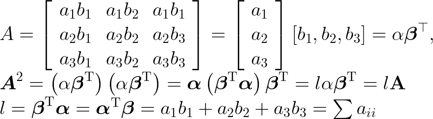
> 
> 
> 即$A^{n}=(\sum a_{ii})^{n-1}A$​​

#### 题型二：主对角线和一侧全为0

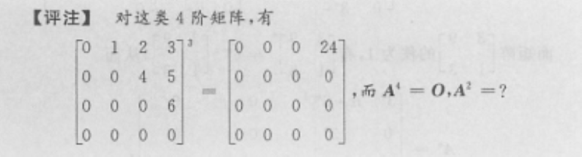

> 这类对于n阶矩阵A，$A^{n}=0$

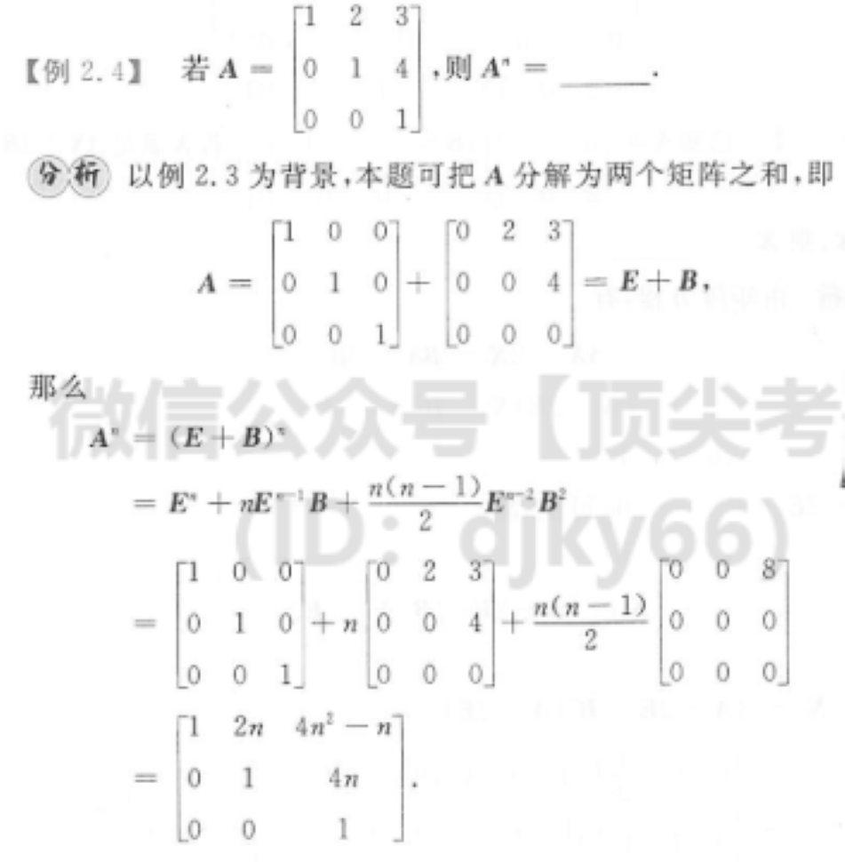

#### 题型三：相似

> $A^{n}=PB^{n}P^{-1}$​​，关键在于选择B矩阵，

> 通常$A ∽ \wedge$​ ，即选B为与A相似对角矩阵，根据与相似对角化的知识，有$A^n=P \wedge^{n} P^{-1}$​，P为特征向量组，$\wedge$​​对角元素为A特征值。

 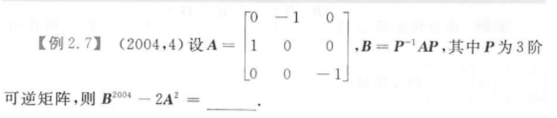

> 解：
>
> 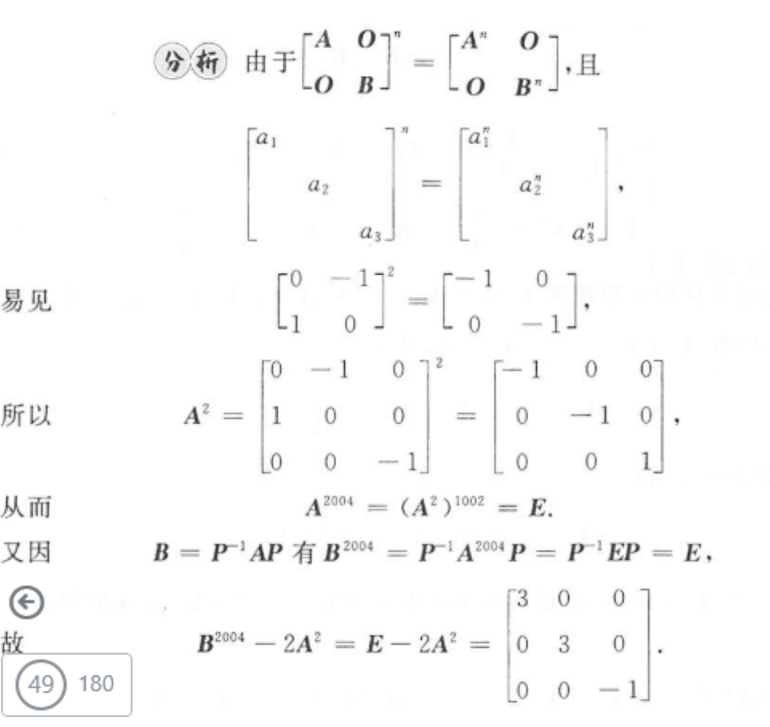

## 伴随矩阵，可逆矩阵

### （一）伴随矩阵

> 由基本公式$AA^{*}=A^{*}A=|A|E$​,可以推导出以下几个公式：
>
> - $A^{-1}= \frac{1}{|A|}A^{*}$
> - $(A^{-1})^{ * } =(A^{*})^{-1}=\frac{1}{|A|}A$​​

> 设A是n阶矩阵
> 
> 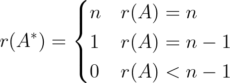
> 
> 证明过程：
> 
> 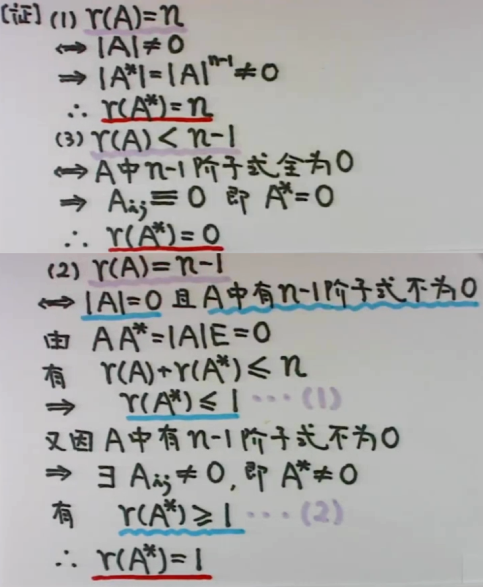

##### 真题

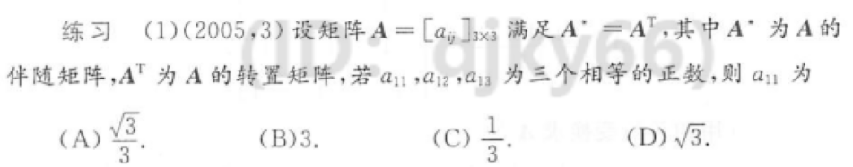

> 由 $A^{*}=A^{T}$，可得：
>
> $A_{ij}=a_{ij},\forall i,j=1,2,3$
>
> 则 对A按照第一行展开有：
>
> 
> $A=a_{11}A_{11}+a_{12}A_{12}+a_{13}A_{13}=(a_{11})^2+(a_{12})^2+(a_{13})^2=3(a_{11})^2$​​​​
> 
> 又根据 $A^{*}=A^{T}$ 有：
>
> $|A^{*}|=|A^{T}|$
>
> 即，$|A|^{3-1}=|A|$​​，$|A|(|A|-1)=0$​，易知|A|≠0，
>
> 故 A=1​
>
> 进而 $3(a_{11})^2=1$ ，$a_{11}=\frac{√3}{2}$

### （二）可逆矩阵

> A可逆 $\Leftrightarrow$ |A| ≠ 0
>
> ​			$\Leftrightarrow$​ r(A) = n
>
> ​			$\Leftrightarrow$​ A的列(行)向量线性无关
>
> ​			$\Leftrightarrow$ 0不是A的特征值

 #### 真题

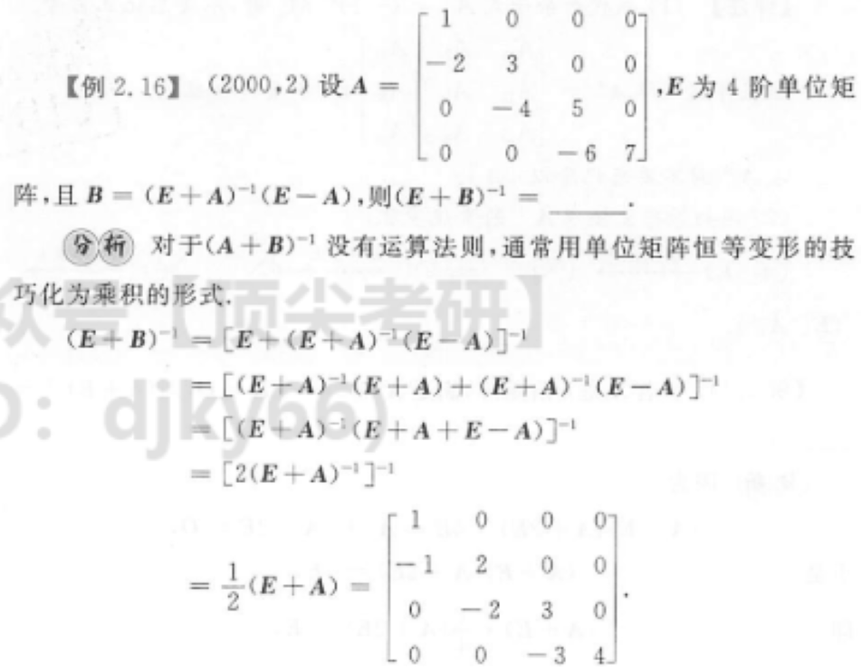

> **单位矩阵与矩阵的转置**
>
> 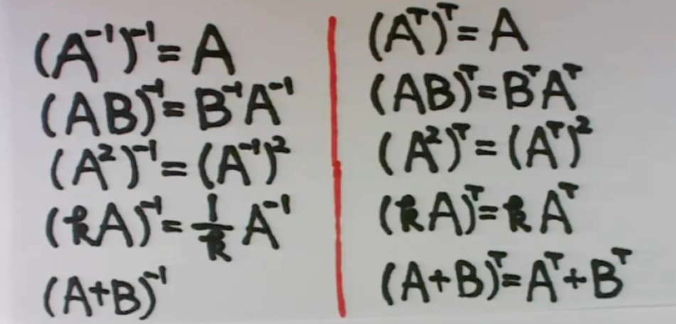

 ## 初等矩阵

> 用初等矩阵P左（右）乘矩阵A，结果PA（AP）就是对矩阵A作一次相应的初等行（列）变换。
>
> “左乘行变换，右乘列变换”

> 初等矩阵均可逆，且其逆是同类型的初等矩阵:
>
> $[\text{倍加}]^{-1}$​​=[倍数取反]​
>
> $[\text{倍乘}]^{-1}$​​​=[取倒数]  (对角矩阵也能理解)
>
> $[\text{互换}]^{-1}$​=[不变]

### 例题

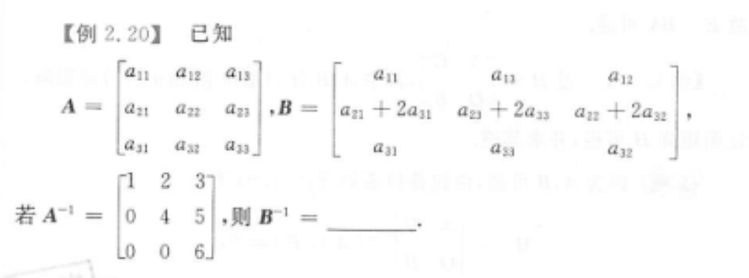

> 观察下标得变换规律

##  正交矩阵

> 内积：
>
> $(\alpha,\beta)=a_1b_1+a_2b_2+...a_nb_n$​
>
>  $\alpha^T \beta,\alpha^T\alpha \text{与}\beta^T\alpha$​表示内积！！！​

> 若$(\alpha,\beta)=0$，称两者正交

> $AA^T=A^TA=E$​，A为正交矩阵。
>
> $\Leftrightarrow$ $A^T=A^{-1}$​  (充要条件)
>
> $\Rightarrow |A|=1 \text{或}-1$​ (必要不充分条件)

> 由$AA^T=A^TA=E$，得其几何意义(判断正交矩阵)：
>
> - 列(行)向量两两正交(正交名称由来)
> - 列(行)向量长度为1

