## 相关、无关

> - 向量组中含零向量必然线性相关
>
> - 组中至少存在两个成比例的向量必然线性相关

### 相关计算

> $A(\alpha_1,\alpha_2,\alpha_3...\alpha_s)$​ 是否线性相关？
>
>   $\Leftrightarrow$​​​ AX=0是否有非零解？(联系克拉默法则)
>
>  $\Leftrightarrow$​​  r(A) < s

特别的，对于**n维向量**：⭐⭐

> - n个n维向量相关 $\Leftrightarrow$​ 行列式得0，即|A|=0
> - n+1个n维向量必然线性相关

此外，还有以下**几何性质**

> “$\alpha$相关”$\Leftrightarrow$ $\alpha=0$
>
> “$\alpha_1,\alpha_2$相关”$\Leftrightarrow$ $\alpha_1,\alpha_2$​共线
>
> > 存在$\alpha_1=k\alpha_2$
>
> “$\alpha_1,\alpha_2,\alpha_3$​相关”$\Leftrightarrow$​  $\alpha_1,\alpha_2,\alpha_3$​​共面

### 证明、选择

> 这是难点，重点

#### 证明线性无关

​	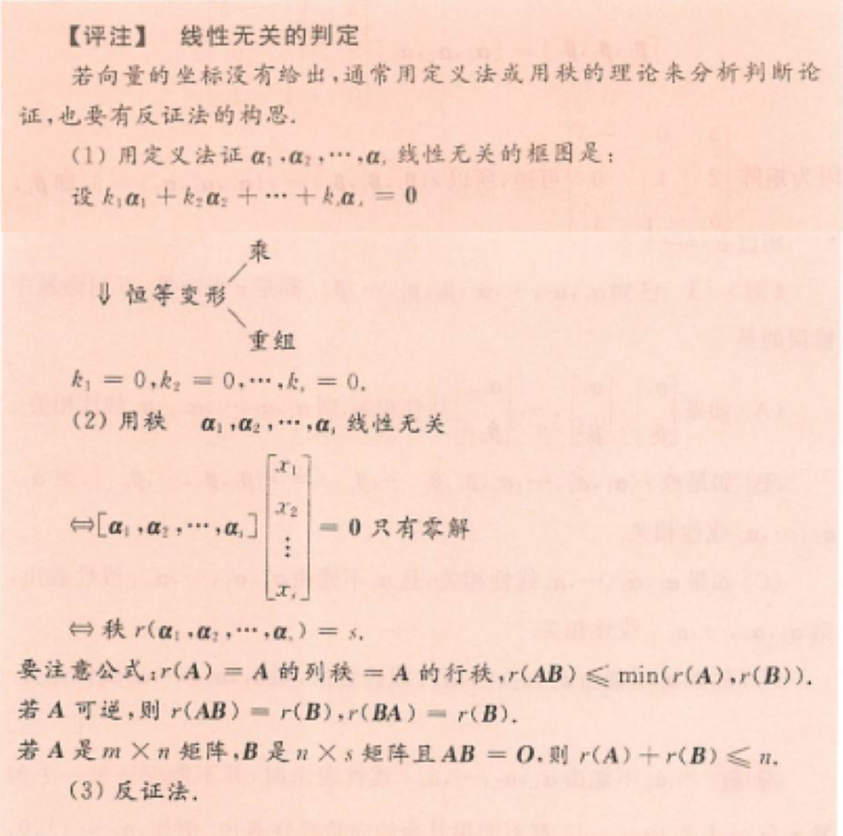

> ⭐特征值不同的特征向量必线性无关。
>
> 此外，不同特征值中如果某一特征值存在“一对多”的关系，这些特征向量也线性无关。即若$A \alpha_1=\lambda_1\alpha_1,A \alpha_2=\lambda_1\alpha_2,A \alpha=\lambda\alpha$，那么$\alpha_1,\alpha_2,\alpha_3$​线性无关​

> 恒等变形中**乘**的思路：
>
> - 利用已知构造出0使得式子变短
> - 直接两边乘A，得出式子，然后通过两个式子的加加减减化简

**真题&经典例题**

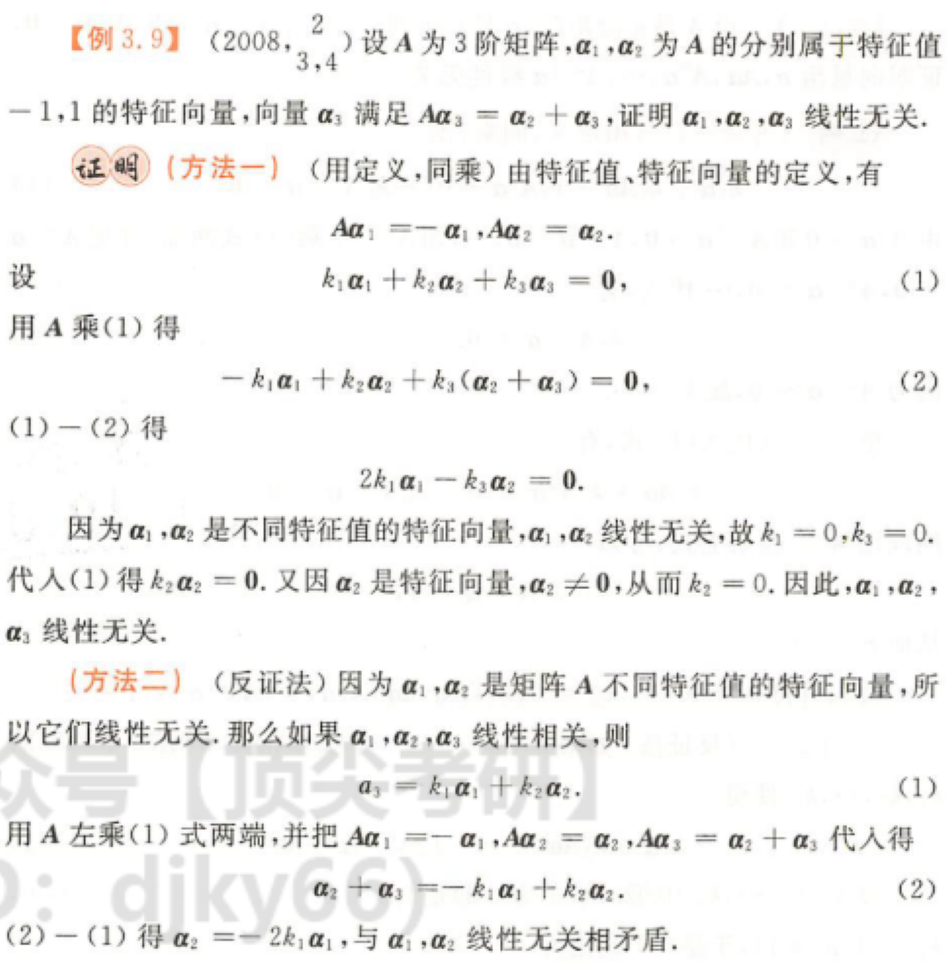

> 本题第二问“写出和A相似的矩阵”(3分)
>
> 分析：*$\alpha_1，\alpha_2，\alpha_3$无关，后面出现$A\alpha_1，A\alpha_2，A\alpha_3$​想到相似*
>
> 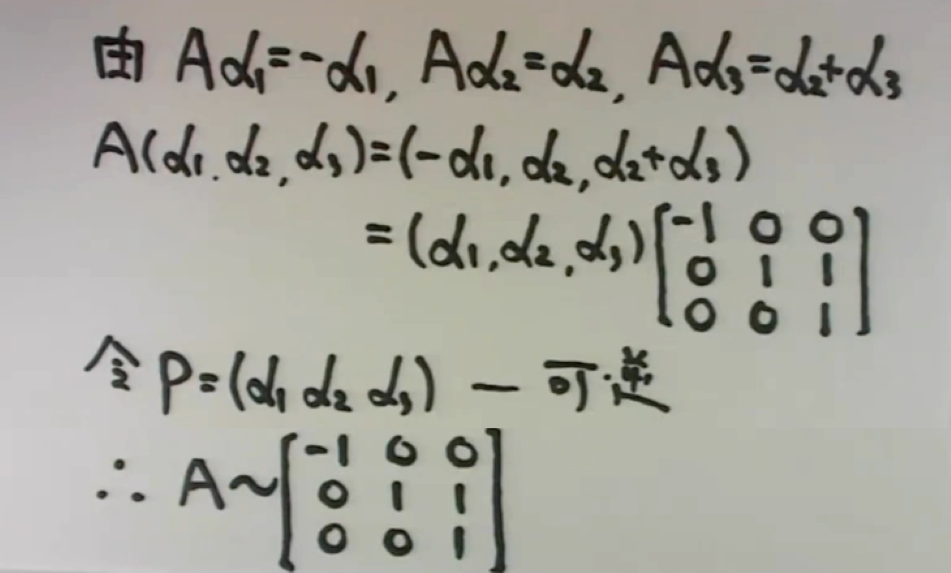

---

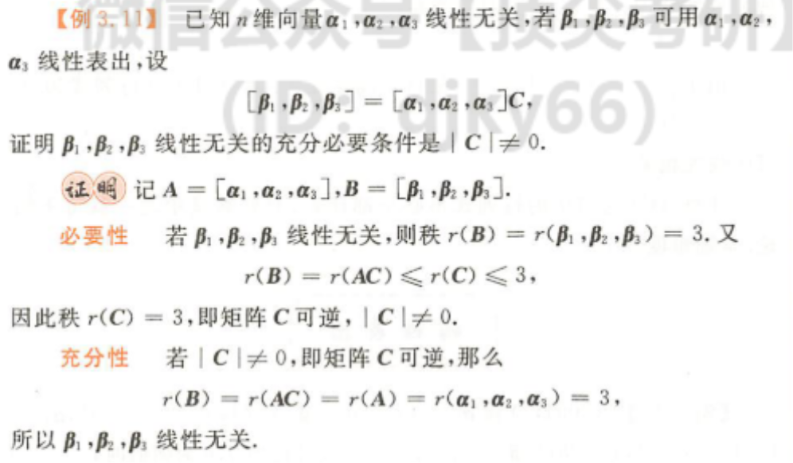

> 本题可以当作结论使用

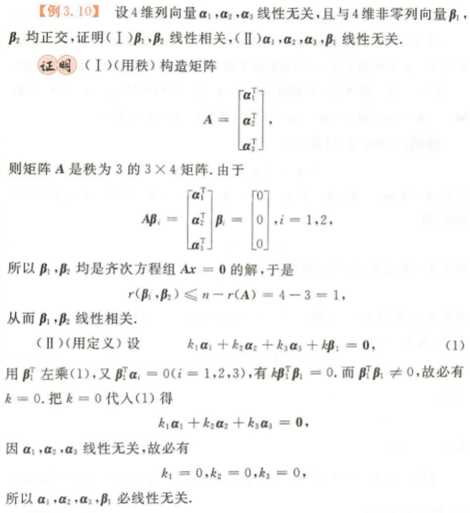

> 注意等式 $r(\beta_1,\beta_2) ≤ n-r(A)$​​ 的含义，对于一个齐次方程组AX=0，其未知数为n个，则其**线性无关的解**有 n-r(A) 个，即所有解的秩 ≤ n-r(A)

##  线性表出 

### 计算

#### 定理

> 转化为AX=B后有如下情况(如果含参)
>
> 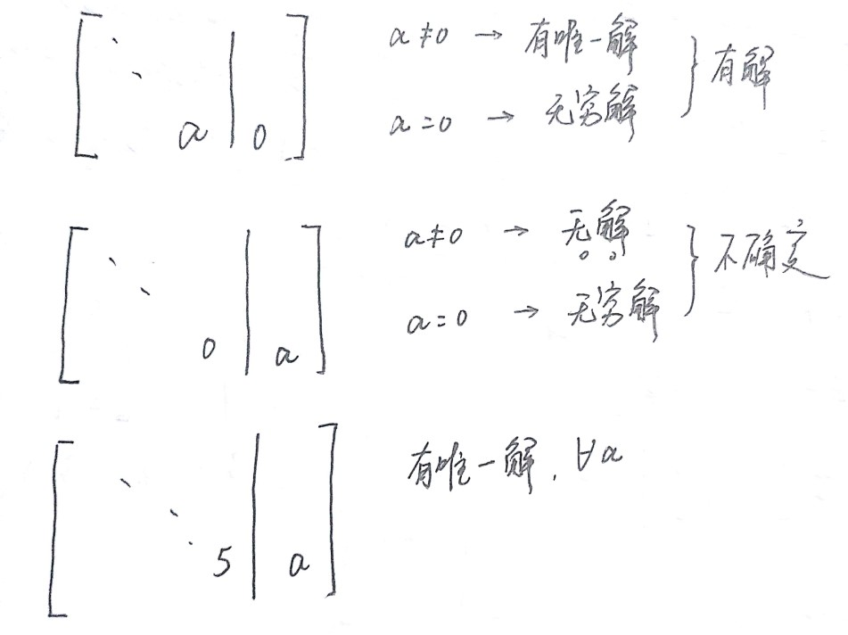

> 现题型多为两个**向量小组**互相线性表出的问题
>
> $\alpha_1\alpha_1\alpha_1...\alpha_s$​​ (1）
>
> $\beta_1 \beta_2 \beta_3 ...\beta_t$    (2)
>
> “向量组线性表出”$\rightarrow$​ 组中**任意**向量可以由另一向量组线性表出
>
> “向量组等价” $\rightarrow$​ 可互相线性表出
>
> “矩阵等价”$\rightarrow$​ 秩相等

#### 真题

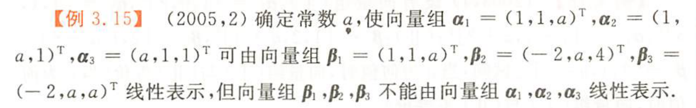

> 解：（定义法）
>
> 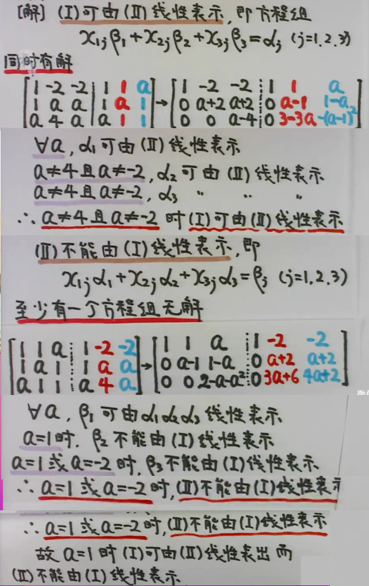
>
> 解法二（秩的方法）
>
> 

### 选择、证明

#### 定理&方法⭐⭐⭐

> (设A为向量组$\alpha_1\alpha_2...\alpha_s$ ，B为$\beta_1\beta_2...\beta_t$)
>
> 1. 子集合相关，整体必相关
>
> 2. 低维无关，高维必无关
>
>    *基础解系求解过程中，先构造1 0/0 1两个无关的低维向量，然后带到方程中求导的另外两个值后，组成的高维向量必然无关。*
>
> 3. A线性**相关** $\Leftrightarrow $ 存在$\alpha_i$​​ 可由A中剩余向量线性**表出**
>
> 4. A线性无关，$A,\beta$​线性**相关**，则$\beta$​​​可以由A线性**表出**，且 **表示方法唯一**
>
> 5. 多数向量可由少数向量线性**表出**，**多**必线性相关
>
>    > (**判断向量个数**) A无关，A可由B线性表出，则s ≤ t
>
> 6. A可由B线性表出，则r(A) ≤ r(B)
>

**方法总结🙅‍**

    (1) 找出两个条件：向量组A无关，(A,β)相关(定理4) 
    (2) 构造方程组，证明方程组有界 » r(A)=r(Ā) 
    (3) 存在等式，找出k≠0，移项，做分母，得到线性表出（证能表出时） 
    (4) 反证法！！（证不能表出时）

 #### 真题&例题

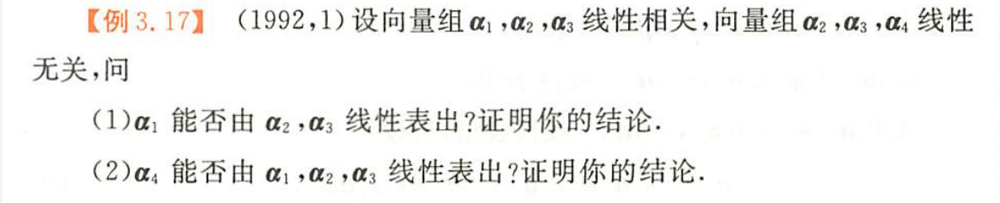

> (1)两种方法
>
> 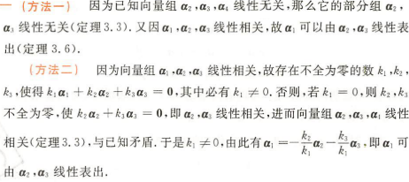
>
> (2)还是两种方法🤓
>
> 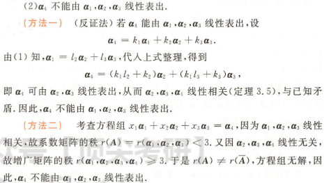

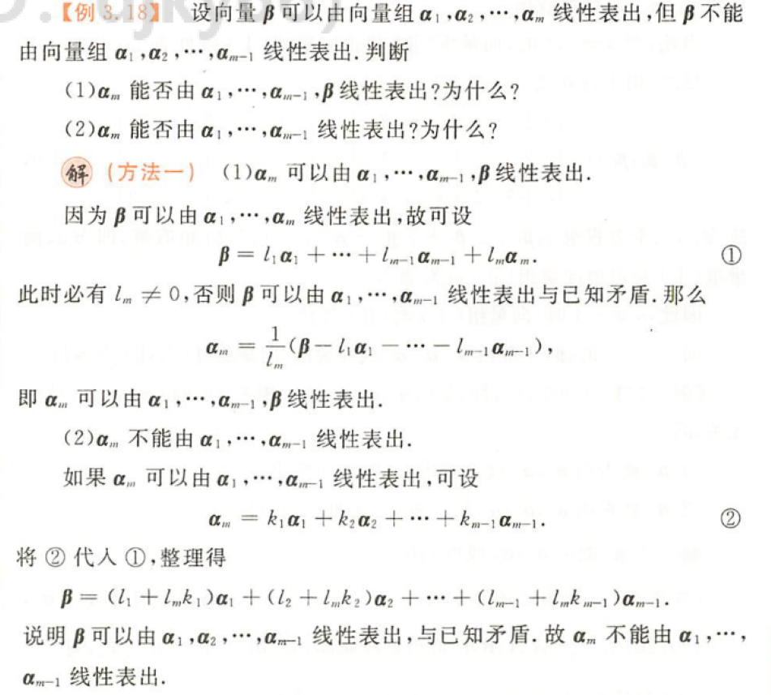

## 秩

### 向量组的秩——极大无关组

> 向量组的极大线性无关组往往是不唯一的，其**成员可以不一样**，但**极大线性无关组中向量的个数**是一样的，由此引出向量组秩的概念，**向量组的秩为r**就是指该向量组的极大线性无关组有r个向量

> **注意以下几个说法等价**：😮
>
> 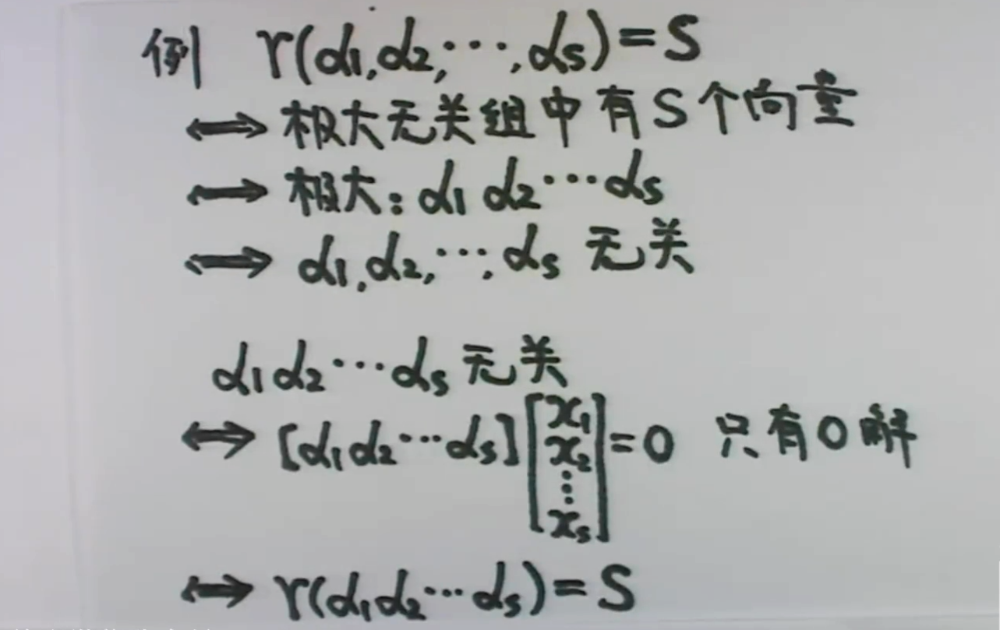

#### 例题

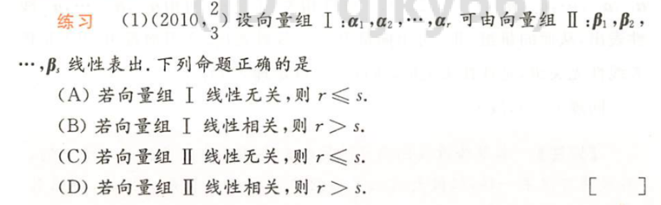

> 解法(一)——<a href="#定理方法"><u>定理6</u></a>
>
> > Ⅰ可以由Ⅱ表出，
> >
> >  则r(Ⅰ) ≤ r(Ⅱ) ≤ s
> >
> >  根据A，若Ⅰ无关，则r(Ⅰ) = r
> >
> >  故 r ≤ s，A说法正确
>
> 解法二：<a href="#定理方法"><u>定理5推论</u></a>
>
> > Ⅰ可以由Ⅱ表出，Ⅰ无关，则  r ≤ s

> 本题可以举反例加以说明
>
> 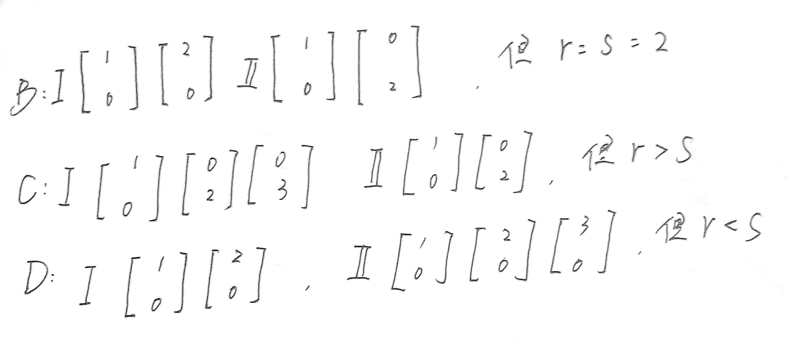

### 矩阵的秩

> 前面有涉及，回顾 <a href="../线性代数行列式/#矩阵秩"><u>GO</u></a>

此外

> r(A) = A的列秩 = A的行秩 (概念不同，数值相等)
>
> 就是 A的秩等于A的列向量组的秩，那么可以**用列向量组的秩求解矩阵的秩**，反过来用矩阵的秩可以求得向量组的秩。

> ⭐经过**初等变换**矩阵的秩不变，也就意味着，在进行秩的计算时，可以对矩阵**既做行变换，又做列变换**，这点要区别于方程组计算过程中尽可以做行变换。

#### 公式

>1. $r(A^TA) = r(A)$  <a href="../线性代数方程组#秩关系的证明"><u>（证明过程）</u></a>
>
>2. $r(kA) = r(A)$​，当k≠0
>3. $r(A+B)≤ r(A)+r(B)$​
>4. r(AB)≤ min{r(A),r(B)},A-m×n,B-n×s
>5. A可逆，r(AB)=r(B),r(BA)=r(B)

#### 真题

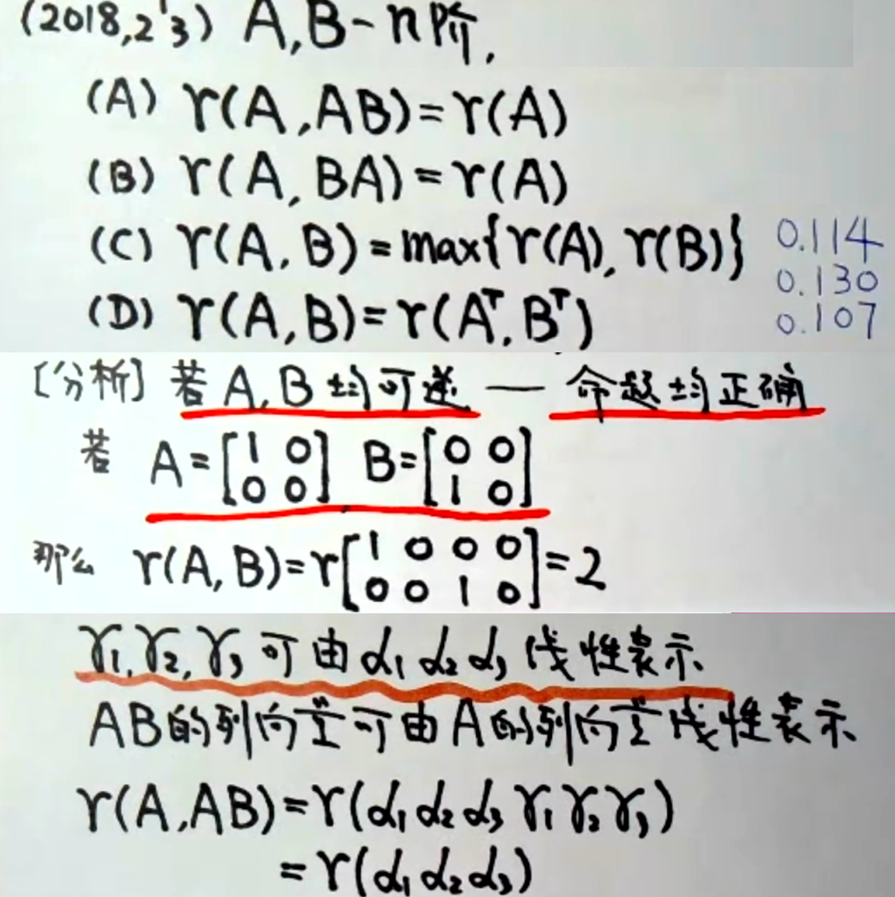

> 先利用特殊值排除掉简单的CD选项
>
> A选项的判断利用矩阵中AB=C的规律，<a href="../线性代数矩阵/#对于-abc"><u>GO</u></a>

