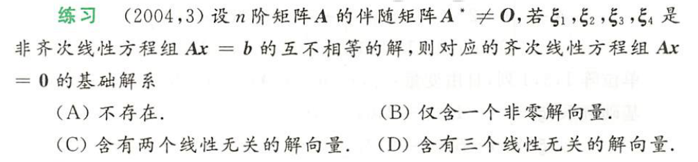
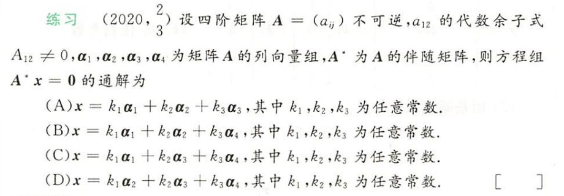
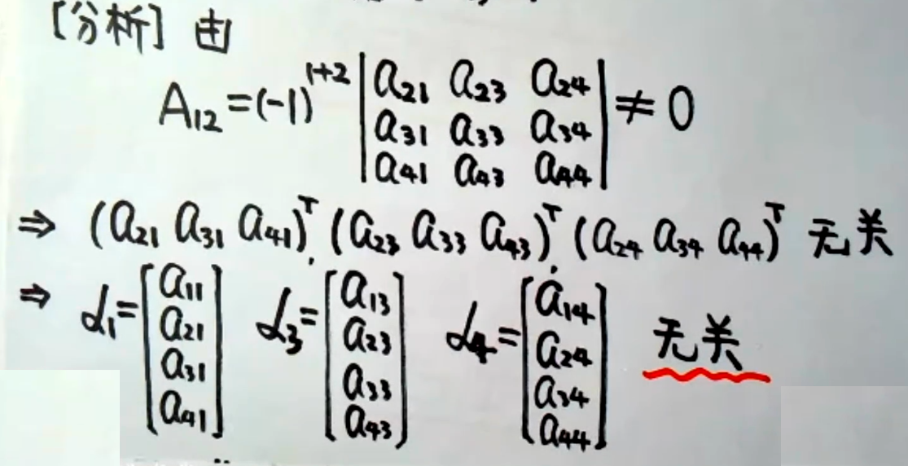
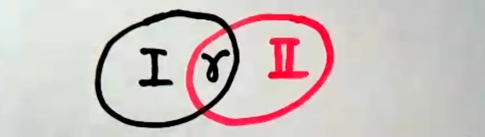
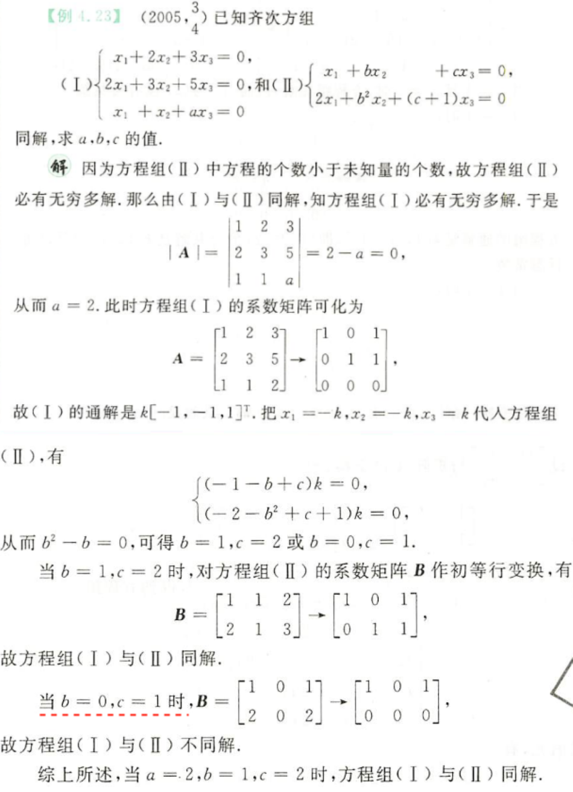
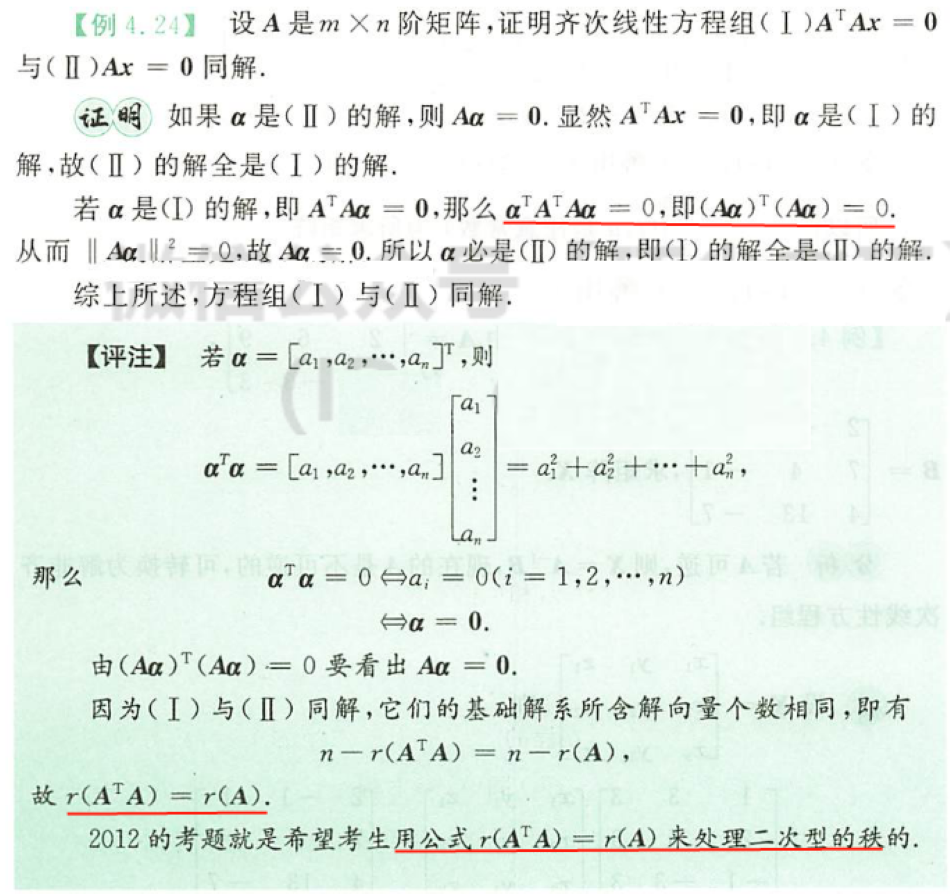
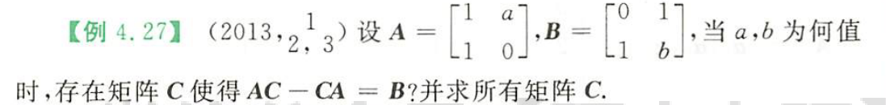
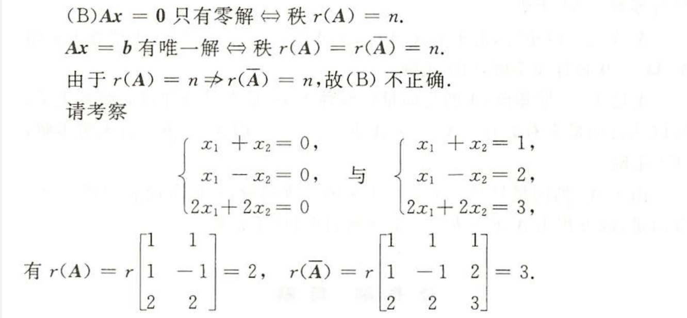

## Ax=0

> **重点： n-r(A)，基础解系**

> Ax=0有非零解 $\Leftrightarrow $​​ r(A) < n (未知数个数)$\Leftrightarrow $​​​  A的列向量线性相关
>
> 特别地(**针对水平型阵和方阵**)，※
>
> - A-m×n,m<n, Ax=0 必有非零解
> - A-n×n，Ax=0有非零解 $\Leftrightarrow $​ |A|=0（**克拉默法则**）

> Ax=0有非零解，则其解线性组合必为Ax=0的解，所以**Ax=0若有非零解，则必有无穷多解**，在这无穷多解中，**线性无关的解向量个数**为 $t=n-r(A)$​​​​​，这就是基础解系​，**基础解系是Ax=0的解向量中的极大线性无关组**。此外，根据定理可知，**Ax=0的任一解都可以由基础解系线性表出**。

> 基础解系⭐
>
> - 是解
> - 是线性无关组
> - 个数t=n-r(A)

### 真题

> 【分析】“基础解系不存在”即为Ax=0没有非零解，根据 t=n-r(A) 知，本题等价转化为求解A的秩，求解秩时，**找个大，找个小，通过夹逼，确定秩的值**。
>
> 【解】$A^{*}\neq0$，则$r(A^{ *})\geq 1$​，则$r(A)\geq n-1$
>
> Ax=b有解且不唯一，则$r(A) < n$
>
> 联立得，r(A)=n-1
>
> 故t = n-r(A) = 1

⭐⭐⭐⭐⭐

> 【分析】根据通解的定义可知，若为通解，解必然线性无关，本题转化为证明 $a_1,a_2,a_3,a_4$哪三个线性无关
>
> 
>
> 这里用到了“**低维无关，添加向量后的高维必无关**”

> 此外，如果本题为**证明计算题（证明基础解系）**，即 求$A^{*}x=0$​ 的基础解系，则
>
> 1. 根据$t=n-r(A^{*})$得基础解系解向量个数。
>    1.  求解$r(A^{*})$​ (**找大找小**)  ，
>       - 根据A不可逆得，$|A|=0, r(A)< n=4$​​
>       - 由 $A_{12} \neq 0$​，则$r(A) \geq n-1=3$​​ 
>       - 则r(A)=3，则$r(A^{*})$ = 1
>    2. t = 4-1=3，即基础解系有三个解向量
> 2. 证明是解
>    1. $A^{*}A=|A| E=0,\text{且}|A|=0$​​ ，有 $A^{ *} (a_1a_2a_3a_4)=0$​​，则向量$a_1,a_2,a_3,a_4$​​ 均为$A^{ *}x=0$​​​ 的解
> 3. 证明线性无关（上面选择题过程）
>
> 🤓

## Ax=b

> **重点：有解判定，解的结构**

> 解的性质：
>
> - 非齐的解相减为齐的解
> - 齐的解+非齐解为非齐解

> 解的结构：非齐特解+齐的基础解系=非齐通解

## 公共解、同解

### （一）公共解

> 1. 两个方程解联立得公共解
> 2. 已知一个方程的基础解系，求得另一个方程的基础解系，设$\beta$​为公共解，则$\beta$​能由两个基础解系分别表出，进而相减得齐次方程组求解。
>
> **注意零解一定是公共解。**
>
> 

### （二）同解

> 对Ax=0，Bx=0，若同解，则
>
> n-r(A)=n-r(B)
>
> 故必要条件 **r(A)-r(B)**

 

#### 秩关系的证明

## 应用

> 根据已知，假设出C，解方程组拼出C，考察基本功

**命题：若Ax=0只有零解，那么Ax=b有唯一解**  ❌

> 

