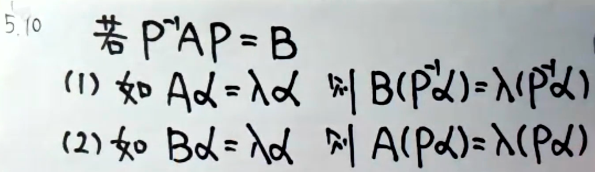

## 特征值与特征向量

###  性质

> 1.不同特征值的特征向量线性无关。
>
> 2.ｋ重特征值至多有ｋ个线性无关的特征向量。(※)

### 基本运算逻辑

> 

> **三角矩阵特征值为主对角线元素⭐**
>
> 
>
> 注意，当$\lambda=1$时😢
>
> 

> **秩为1的矩阵A**
>
> - 特征值 $\sum_{aii},0,0...$
> - $A^n=\sum_{aii}^{n-1} A$​  
>
> 特征值证明：
>
> 

> **求特征值不能先对A做任何变换，而应该带着λ变换**

### 定义法

> 

> **如果两矩阵相似**
>
> 
>
> 即 **“两矩阵相似则具有相同特征值，特征向量也存在关系”**

#### 真题&例题

常识题？😢

 关于**AB=0**引申出的一题多解

## 相似

> AB相似，则 **A+kE ~ B+kE**
>
> - 行列式相等 
> - 俩秩相等 
> - 特征值相等
> - 绩相等
>
> **利用已知构造方程组求参，进行预处理**

> 由 $A^n=PB^nP^{-1}$
>
> - 若取**B为∧**，容易求得$A^n$​的值。[(其他方法)](../线性代数矩阵/#an)
> - 特征值也存在关系。([特征值规律](./#定义法))

> **用相似的传递性证明两矩阵相似**

### A~∧ ⭐

> A~∧，$A=P∧P^{-1}$则
>
> - ∧是矩阵A的特征值
> - P列向量是A的特征向量
>
> （**要对应，别错位**）
>
> - **A~∧  ⇔   矩阵A有n个线性无关的特征向量。** （注意是充要条件）
>
> 

> 要**求解A~∧(相似对角化)** ，注意下面图解
>
> 1. 检查是否和对称矩阵相似
> 2. 检查是否有n个特征值
> 3. 检查k重特征值是否有k个无关的特征向量(n-r(λE-A))
>
> 
>
> 

#### 例题

> 一正一负必能相似对角化

> 第(1)问这一思路一定要熟练把握$A\alpha$出现求特征值，想到用定义！！
>
> 第（2）问两种思路，

**已知特征值、特征向量反求A矩阵**

## 实对称

### 性质

> 1. 实对称矩阵必与对角矩阵相似；
>
> 2. 实对称矩阵特征值不同特征向量**相互正交**；
>
>    > 内积为0 ⇒ 齐次方程组 ⇒ 求得特征值
>
> 3. 实对称矩阵可用正交矩阵相似对角化
>
>    > $Q^{-1}AQ=Q^{T}AQ$ 
>
> 4. 实对称矩阵特征值必为实数

### 例题

### 用正交矩阵相似对角化

> 对比[相似矩阵对角化](./#a-)
>
> 这里需要用到正交化↧

### Schmidt正交化

> ||β|| 是向量的长度
>
> 分子为内积
>
> 分母为平方和

