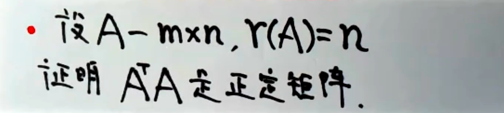

## 性质定理

> 二次型$x^{T}Ax$经坐标变换$x=Cy$得二次型$y^{T}By$，其中 $B=C^{T}C$，通俗的讲，就是 **二次型矩阵经过任意的一次坐标变换得到新的二次型，前后二次型矩阵合同。**

> 任一二次型都可经坐标变换**变成标准型**。
>
> - 配方法
>
>   从$x_1$开始先合并再配方，将 f(x)⇒f(y)
>
> - 正交变换法
>
>   

### 例题

> 说明**在正交变换下，A不仅与∧合同，而且A与∧相似**

### 用正交变换化二次型为标准形

> 参考[用正交矩阵相似对角化](../线性代数特征值特征向量#用正交矩阵相似对角化)

> 若是求正负惯性指数，根据特征值即可得到（特征值是二次型二次项系数✅）

### 标准型到规范型

> 标准型到规范性与系数的大小无关，只与系数的正负相关，即**正负惯性系数**，注意先排序，依次“大于0，等于0，小于0...”

### 例题

> 第一问参数的求解用到标准型化成规范型的规律。
>
> 第二问的求解实际上就是[正交矩阵相似对角化](../线性代数特征值特征向量#用正交矩阵相似对角化)

## 正定

> 

> **注意正定矩阵是二次型，所以正定矩阵必对称，检验正定之前，先检验对称性，即证明$A^{T}=A$**

### 正定必要条件

- $a_{ii}>0$
- |A| > 0

### 正定充分必要条件

- 顺序主子式全大于0
- 特征值大于0
- 正惯性指数 p=n
- $A=C^TEC$，其中C可逆 ▲

### 经典例题

> $(A^{T}A)^{T}=A^TA$，故$A^{T}A$实对称矩阵
>
> 现证$\forall X$，有$X^T(A^TA)X>0$
>
> $X^T(A^TA)X=(AX)^{T}AX \geq 0$
>
> 现证$(AX)^{T}AX \neq 0$
>
> 相当于证 $AX \neq0$
>
> 由于A-m×n，且r(A)=n
>
> 故 AX=0只有零解
>
> 等价于 $\forall X\neq0,AX \neq0$
>
> 得证 
>
> 即$\forall X, X^T(A^TA)X=(AX)^{T}AX > 0$
>
> 故$A^TA$为正定矩阵

> 补充：“**反对称矩阵**”
>
> $A^T=-A$
>
> 规律：
>
> $a_{ii} = 0\text{；}a_{ij}=-a_{ji}$
>
> $|A|=|A^T|=|A^{-1}|=(-1)^n|A|$，即奇数项行列式必为0

## 合同

> **相似**
>
> 若不是实对称矩阵，为普通矩阵，则通过∧作为媒介判断，其中∧为特征值组成的🤓
>
> 
>
> 即 “**相似⇒合同，合同⇏相似**”

