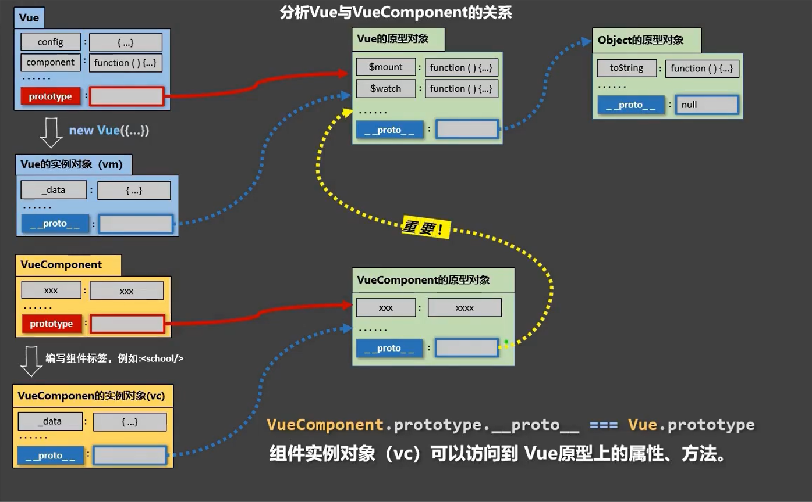
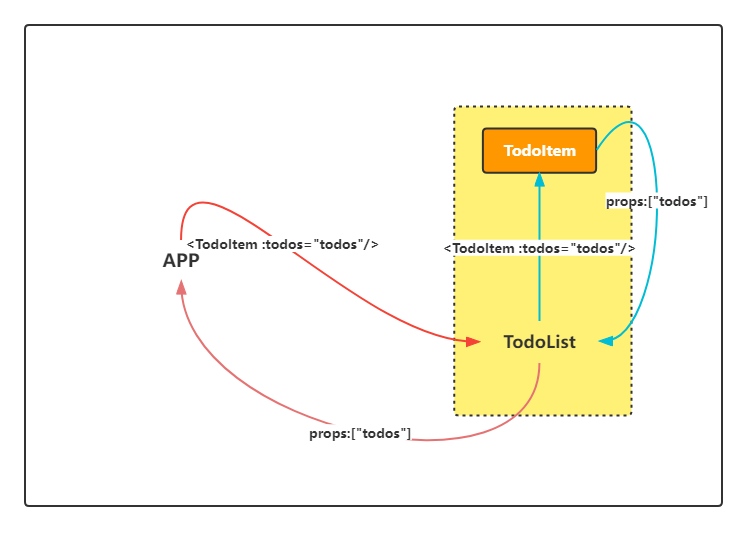
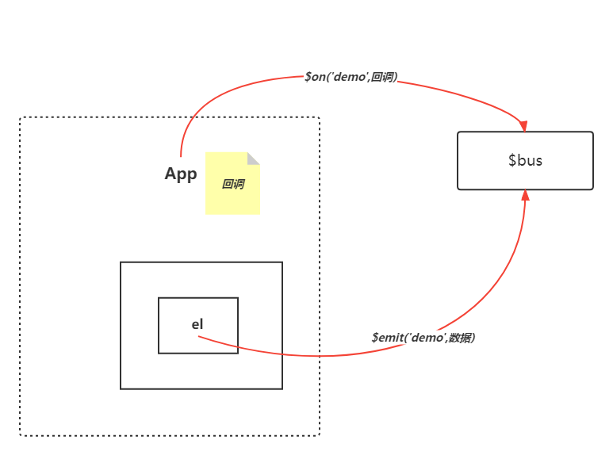

## 关于Vue和VueComponent

1. 一个重要的内置关系:`VueComponent.prototype.proto===vue.prototype`

   

2. 为什么要有这个关系？

   让组件实例对象(vc)可以访间到Vue原型上的属性、方法.

## ref属性

1.被用来给元素或子组件注册引用信息(id的替代者)

2.应用在htm1标签上获取的是真实DOM元素,应用在组件标签上是组件实例对象(vc)

3.使用方式:
打标识: `<h1 ref="xxx">.....</h1>`或`<School ref="xxx"></School>`
获取:`this.$refs.xxx`

## 配置项props

功能: 让组件接收外部传过来的数据

(1).传递数据:

`<Demo name="xxx"/>`

(2).接收数据:

第一种方式(只接收):

`props:['name']`

第二种方式(限制类型):

`props:{ name:String }`

第三种方式(限制类型、限制必要性、指定默认值):

```js
props:{
    name:{
        type:String,//类型限制
        required:true,//必要性
    	default:"JQF"//默认值
    }
}
```

备注: props是只读的,Vue底层会监测你对props的修改,如果进行了修改,就会发出警告, 若业务需求确实需要修改,那么请复制props的内容到data中一份,然后去修改data中的数据.

## mixin(混入)

功能: 可以把多个组件共用的配置提取成一个混入对象

使用方式:

第一步：定义混合

```js
const mixData={
    data(){...}
},
const mixMethods= {
    methods:{...}
}
```

第二步：使用混入

(1).全局混入:`Vue.mixin(xxx)`

(2).局部混入:`mixins:[xxx']`

## 插件

功能:用于增强vue

本质:包含install方法的一个对象,install的第一个参数是vue,第二个以后的参数是插件使用者传递的数据。

定义插件:

```js
对象.install = function (Vue, options) {
//1.添加全局过滤器 
    Vue.filter(..)
//2.添加全局指令 
    Vue.directive(....)
//3.配置全局混入(合)
    Vue.mixin(....)
//4.添加实例方法 
    Vue.prototype.$myMethod = function () {...}
    Vue.prototype.$myProperty = xxxx
} 
```

使用插件:`Vue.use()`

## scoped样式
作用:让样式在局部生效,防止冲突.

写法:`<style scoped>`

此外，还可以通过`lang`指定css的语言，比如 `css(默认),sass,less(推荐)`等，但要注意用npm安装对应解析器

## 总结TodoList案例

> 仅通过属性和`props`在组件间传递数据



1. 组件化编码流:

   1. 拆分静态组件:组件要按照功能点拆分,命名不要与html元素冲突.
   2. 实现动态组件:考虑好数据的存放位置,数据是一个组件在用,还是一
         些组件在用:

	- 一个组件在用:放在组件自身即可.
	- 一些组件在用:放在他们共同的父组件上(状态提升).
	- 实现交互:从绑定事件开始.

 2. props适用于:
    
     1. 父组件 ==> 子组件通信
     2. 子组件 ==> 父组件通信(要求父先给子一个函数)

3. 使用`v-model`时要切记: `v-models`绑定的值不能是props传过来的值,因为props是不可以修改的!
   
4. props传过来的若是对象类型的值,修改对象中的属性时Vue不会报错,但不推荐这样做.

## 组件的自定义事件

1. 一种组件间通信方式，适用于： **子组件===>父组件**

2. 使用场景：A是父组件，B是子组件，B想给A传数据，那么就要在A中给B绑定自定义事件，B中通过`$emit`出发自定义事件并传递数据（**事件的回调在A中**）

3. 具体使用方式：

   1. 绑定自定义事件：

      - 第一种方式：在父组件中：`<Demo @jqf="test"/>`或`<Demo v-on:jqf="test"/>`

      - 第二种方式，在父组件中：

        ```js
        <Demo ref="demo"/>
        ......
        methods:{
            test(){//do something}
        },
        mounted(){
        	this.$refs.demo.$on('jqf',this.test)
        }
        ```

      - 如果想让自定义事件只触发一次，可以通过使用`once`修饰符(第一种方式)，或者`$once`方法(第二种方式)

   2. 触发自定义事件：`this.$emit('jqf',data...)`

   3. 解绑自定义事件：`this.$off('jqf')`

4. **组件**上也可以绑定原生DOM事件，需要使用`native`修饰符(否则会默认为自定义事件)

5. 注意，通过`this.$refs.demo.$on('jqf',回调)` 绑定自定义事件时，回调**要么配置在methods中，要么使用箭头函数**，否则this的指向会出现问题！

## 全局事件总线(GlobalEventBus)

1. 一种组件间通信的方式，适用于**任意组件间通信**🧐

2. 具体使用步骤：

   1. 安装全局事件总线

      ```js
      new Vue({
          ......
          beforeCreate(){
          	Vue.prototype.$bus=this//全局事件总线，$bus就是当前应用的vm
      	}，
          ......
      })
      ```

   2. 使用事件总线：

      - 接收数据：A组件想接收数据，则在A组件中给$bus绑定自定义事件，事件的**回调留在A组件自身**。

        ```js
        methods(){
            demo(data){......}
        }
        ......
        mounted(){
            this.$bus.$on('xxx',this.demo)
        }
        ```

      - 提供数据：传递数据给指定指令

        ```js
        this.$bus.$emit('xxx',数据)
        ```

3. 图示

   

4. 注意点

   最好在`beforeDestory`钩子中用`$off('xxx')`解绑**当前组件所用到的**事件。

   父子之间互相通信还是用上面的方法！

## 消息订阅与发布(pubsub)

1. 一种组件间通信的方式，适用于**任意组件间通信**。

2. 使用步骤：

   1. 安装pubsub: `npm i pubsub-js`

   2. 引入pubsub:`import pubsub from 'pubsub-js'`

   3. 接收数据：A组件想接收数据，则在A组件中订阅消息，订阅的回调留在A组件自身。

      ```js
      ...... 
      methods: {
          demo(msgName, data) {...}
        },
      ......
        mounted() {
          this.pubId = pubsub.subscribe('xxx', this.demo)//订阅消息
        },
       ......     
        beforeDestroy() {
          pubsub.unsubscribe(this.pubId)
        },
      ```

   4. 提供数据：`pubsub.publish('schoolNameTrans',this.name)`

3. 注意点

   在`beforeDestroy` 钩子中，用`unsubscribe(pubId)`  **取消订阅**消息

   在Vue中，其实用全局事件总线更方便点🤓

## nextTick

1. 语法：`this.$nextTick(回调函数)`
2. 作用：在下一次DOM更新结束后执行其回调
3. 什么时候用：当改变数据后，要**基于更新后的新DOM进行某些操作**时，要在nextTick所指定的回调函数中执行。

> 在修改数据后不会立马重新解析模板，而是在本次所有语句执行完后再进行模板解析，所以有时候在更新数据后立即操作DOM（比如获取焦点操作），会不起作用，这时候就需要用到`nextTick`，或者`setTimeout`也可以

## Vue封装的过渡与动画

1. 作用：在**插入、更新或移除**DOM元素时，在合适的时候给元素添加样式类名。

2. 图示：

   

   3. 具体用法

      1. 第一种方式：自定义过渡或者样式：

         1. 准备好样式(CSS)：(默认为`v-`)

            - 进入：`[name]-enter,[name]-enter-active,[name]-enter-to`
            - 离开：`[name]-leave,[name]-leave-active,[name]-leave-to`

         2. 使用`<transition>`或`<trasition-group>`包裹过渡的元素，并设置name属性：

            ```html
            <transition name="hello">
                <h1>HELLO</h1>
            </transition>
            
            <transition-group>
                <span key="1">1</span>
                <span key="2">2</span>
                <span key="3">3</span>
            </transition-group>
            ```

      2. 第二种方式：使用第三方动画库，比如[Animate.css](https://animate.style/)

         1. 安装并且引入

            ```shell
            #安装
            npm i animate.css
            ```

            ```js
            //引入
            import 'animate.css'
            ```

         2. 给`<transition>`或`<trasition-group>`添加类名`animate__animated animate__bounce`

         3. 添加相应动画，直接在`<transition>`或`<trasition-group>`上添加相应属性

            ```vue
            <transition-group
                    appear
                    class="animate__animated animate__bounce"
                    enter-active-class="animate__bounceIn"
                    leave-active-class="animate__bounceOutLeft"
                >
                  <h2 v-show="a" key="1">嘿嘿额</h2>
                  <h2 v-show="a" key="5">嘿嘿额</h2>
            </transition-group>
            ```

            *其中appear是让动画在初始进入的时候就生效*


## Vue脚手架配置代理

官网[GO](https://cli.vuejs.org/zh/config/#devserver-proxy)

### 方式一

​	在vue.config.js中添加如下配置：

```js
devServer:{
    proxy:"http://localhost:5000"
}
```

**说明：**

1. 优点：配置简单，请求资源时直接发给前端（8080）即可。
2. 缺点：不能配置多个代理，不能灵活的控制请求是否走代理。
3. 工作方式：若按照上述配置代理，当请求了前端不存在的资源时，那么该请求会转发给服务器（优先匹配前端资源）

### 方式二

在Vue.config.js配置具体的代理规则

```js
const { defineConfig } = require('@vue/cli-service')
module.exports = defineConfig({
  ......
  devServer:{
    proxy:{
      //匹配所有以'/api1'开头的请求路径
      'api1':{
        target:'http://localhost:5000/',//代理目标的基础路径
        changeOrigin:true,
        pathRewrite:{'^/api1':''}//请求路径重写
      },
      //匹配所有以'/api2'开头的请求路径
      'api2':{
        target:'http://localhost:5001/',
        changeOrigin:true,
        pathRewrite:{'^/api2':''}
      }
    }
  }
})
// changeOrigin设置为true时,服务器收到的请求头中的host为:1oca1host:5000
// changeOrigin设置为false时,服务器收到的请求头中的host为:localhost:8080
// changeOrigin默认值为true

```

**说明：**

1. 优点：可以配置多个代理，且可以灵活的控制请求是否走代理
2. 缺点：配置略微繁琐，请求资源时必须加前缀。

## 插槽

1. 作用：让父组件可以向子组件指定位置插入htm结构，也是一种组件间通信的方式(<u>这里通信的数据是html结构</u>)，适用于**父组件===>子组件**。

2. 分类：默认插槽、具名插槽、作用域插槽

3. 具体使用方式：

   1. 默认插槽：

      ```vue
      <!--父组件中：-->
      <itemList>
            <span>我是插槽内容</span>
      </itemList>
      
      <!--子组件中：-->
      <slot>插槽中默认的内容，没有内容时显示</slot>
      ```

   2. 具名插槽：

      ```vue
      <!--父组件中：-->
      <itemList>
      	<span slot="center">我是中间</span>
      	<!--Vue2.6+新出的属性-->
      	<template v-slot:footer>
         		<h4>我是底部</h4>
        	 	<span>Lorem ipsum dolor sit amet...</span>
      	</template>
      </itemList>
      
      <!--子组件中：-->
      <slot name="center"/>
      <slot name="footer"/>
      ```

   3. 作用域插槽🧐

      理解：**数据在组件的自身,但根据数据生成的结构需要组件的使用者来决定**。(games数据在itemList组件中,但使用数据所遍历出来的结构由App组件决定)，其实实现了数据的 **子组件===>父组件**

      ```js
      //父组件中(App)：
      <itemList>
        <template scope="dataObj">
          <h3>无序列表</h3>
          <ul>
            <li v-for="(game,ind) in dataObj.games" :key="ind">{{ game }}</li>
          </ul>
          <br>
          <h3>有序列表</h3>
          <ol>
            <li v-for="(game,ind) in dataObj.games" :key="ind">{{ game }}</li>
          </ol>
         </template>
      </itemList>
      
      //子组件(itemList)中：
      <slot :games="games">默认内容</slot>
      
      ......
      data() {
          return {
            games: ["红色警戒Ⅱ共和国之辉", "红色警戒Ⅱ尤里的复仇", "CS1.6", "流星蝴蝶剑"]
          }
        }
      ......
      ```


## Vuex

   ### 1. 概念：

在Vue中实现集中式态（数据）管理的一个Vue插件，对vue应用中多个组件的共享状态进行集中式的管理（读/写），也是一种组件间通信的方式，且适用于**任意组件间通信**。

   ### 2. 何时使用：
   多个组件需要**共享**数据时

   ### 3.原理图：

 

   ### 4. 搭建Vuex环境


  1. 创建文件：`src/store/index.js`(官方推荐方式)

     ```js
     //引入Vue核心库
     import Vue from 'vue'
     //引入Vuex
     import Vuex from "vuex";
     //应用Vuex插件
     Vue.use(Vuex)
     
     //准备actions对象，相应组件中用户的动作
     const actions = {}
     //准备mutations对象，修改state中的数据
     const mutations = {}
     //准备state对象，保存具体数据
     const state = {}
     
     //创建并暴露store
     export default new Vuex.Store({
         actions,//对象中的简写形式
         mutations,
         state
     })
     ```

  2. 在`main.js`中创建vm时传入`store`配置项

     ```js
     ......
     import store from './store'
     ......
     
     new Vue({
         render: h => h(App),
         store//对象中的简写形式
     }).$mount('#app')
     
     ```


   ### 5. 基本使用

1. 初始化数据、配置`actions`、配置`mutations`，操作文件`store.js`

   ```js
   //引入Vue核心库
    import Vue from 'vue'
    //引入Vuex
    import Vuex from "vuex";
    //应用Vuex插件
    Vue.use(Vuex)
    
    //准备actions对象，相应组件中用户的动作
    const actions = {
        //可以进行复杂逻辑处理
        incOdd(context, value) {
            if (context.state.sum % 2) {
                context.commit('INC', value)
            }
        },
    }
    //准备mutations对象，修改state中的数据
    const mutations = {
        //mutations中的方法应该大写更规范
        INC(state, value) {
            state.sum += value
        },
    }
    //准备state对象，保存具体数据
    const state = {
        sum: 1
    }
    
    //创建并暴露store
    export default new Vuex.Store({
        actions,
        mutations,
        state
    })
   ```
  2. 组件中读取vuex中的数据：`$store.state.sum`
    
  3. 组件中修改vuex中的数据：`$store.dispatch('actions中的方法名',数据)`或`$store.commit('mutations中的方法名',数据)`
     

> 备注：若没有网络请求或其他业务逻辑，组件中也可以越过`actions`，即不写`dispatch`，直接编写`commit`

### 6. getters的使用

   1. 概念：当state中的元数据需要**复杂的逻辑处理之后再暴露**出去共享时，使用getters加工。
    
   2. 在`store.js`中追加`getters`配置
      
      ```js
      const getters = {
          handleSum(state){
              return state.sum * 10//...模拟复杂的逻辑
          }
      }
      
      //创建并暴露store
      export default new Vuex.Store({
        ......
        getters
      })
      ```
    
   3. 组件中读取数据：`$store.getters.handleSum`

### 7. 三个map方法的使用

   > 先引入：`import {mapState, mapActions, mapMutations, mapGetters} from 'vuex'`

   1. `mapState`：映射在`state`中的数据为计算属性。
      
      ```js
      computed:{
      //原始写法
      /*sum(){
          return this.$store.state.sum
        },
        name(){
          return this.$store.state.name
        },
        address(){
          return this.$store.state.address
        },*/
          
        //借助mapState生成计算属性：sum、name、address（对象写法）
        ...mapState({sum: 'sum',name:'name',address:'address'}),
            
        //借助mapState生成计算属性：sum、name、address（数组写法）      
        ...mapState(['sum','name','address'])
      }
      ```
    
2. `mapGetters`：映射在`getters`中的数据为计算属性。
   
      ```js
      computed:{
        //借助mapGetters生成计算属性：handleSum（对象写法）
        ...mapGetters({handleSum:'handleSum'}),
            
        //借助mapState生成计算属性：handleSum（数组写法）      
        ...mapGetters(['handleSum'])
      }
      ```

3. `mapActions`：映射在`action`中的方法，即包含`$store.dispatch(xxx)`的函数。

   ```js
   methods:{
     //借助mapActions生成incOdd（对象写法）
     ...mapActions({incOdd:'incOdd'}),
         
     //借助mapActions生成incOdd（数组写法）      
     ...mapActions(['incOdd'])
   }
   ```

4. `mapMutations`：映射在`mutations`中的方法，即包含`$store.commit(xxx)`的函数。

   ```JS
   methods:{
     //借助mmapMutations生成INC（对象写法）
     ...mapMutations({INC:'INC'}),
         
     //借助mapMutations生成INC（数组写法）      
     ...mapMutations(['INC'])
   }
   ```


### 8. vuex模块化+命名空间

1. 目的：让代码更好维护，让多种数据分类更加明确。

2. 修改`store.js`

   ```js
   const countAbout = {
       namespaced: true,//开启命名空间
       actions: {...},
       mutations: {...},
       state: {...},
       getters: {...}
   }
   const personAbout = {
       namespaced: true,//开启命名空间
       actions: {...},
       mutations: {...},
       state: {...},
       getters: {...}
   }
   
   export default new Vuex.Store({
       modules: {
           countAbout,
           personAbout
       }
   })
   ```

   > 当一个命名空间中的内容过于繁琐时，可以通过Es6模块化的语法新建文件进行精简

3. 开启命名空间后，组件中读取state数据：

   ```js
   //方式一：直接读取
   this.$store.state.personAbout.persons
   //方式一：借助mapState读取
   ...mapState('personAbout', ['persons']),
   ```

4. 开启命名空间后，组件中读取getters数据：

   ```js
   //方式一：直接读取
   this.$store.getters['countAbout/handleSum']
   //方式一：借助mapState读取
   ...mapState('countAbout', ['handleSum']),
   ```

5. 开启命名空间后，组件中调用dispatch，执行actions中的方法：

   ```js
   //方式一：直接读取
   this.$store.dispatch['countAbout/incOdd',num]
   this.$store.dispatch['countAbout/incWait',num]
   //方式一：借助mapState读取
   ...mapActions('countAbout', {incrementOdd: 'incOdd', incrementWait: 'incWait'})
   ```

6. 开启命名空间后，组件中调用commit，执行mutations中的方法：

   ```js
   //方式一：直接读取
   this.$store.commit['countAbout/INC',num]
   this.$store.commit['countAbout/DEC',num]
   //方式一：借助mapState读取
   ...mapMutations('countAbout', {increment: 'INC', decrement: 'DEC'})
   ```

## 路由

1. 理解：一个路由（route）就是一组映射关系（key-value），多个路由需要路由器（router）进行管理。
2. 前端路由：key是路径，value是组件。

### 1.基本使用

1. 安装vue-router：`npm i vue-router`

2. 引入、应用插件并写好配置项：

   ```js
   ...
   import vueRouter from 'vue-router'
   import router from './router'
   
   Vue.use(vueRouter)
   
   new Vue({
       render: h => h(App),
       router
   }).$mount('#app')
   
   ```

3. 编写在`router/index.js`的配置项

   ```js
   //用于创建整个应用的路由
   import vueRouter from "vue-router";
   //引入相应组件
   import About from "@/components/About";
   import Home from "@/components/Home";
   
   //创建并暴露路由器
   export default new vueRouter({
       routes: [
           {path: '/about', component: About},
           {path: '/home', component: Home}
       ]
   })
   ```

4. 实现切换（active-class可配置高亮样式）

   ```html
   <router-link active-class="active" to="/home">Home</router-link>
             <router-link active-class="active" to="/about">About</router-link>
   ```

5. 指定展示位置

   ```html
   <router-view></router-view>
   ```

### 2.几个注意点

1. 路由组件通常存放在pages文件夹，一般组件通常存放在components文件夹。
2. 通过切换，“隐藏”了的路由组件，默认是被销毁掉的，需要的时候再去挂载。
3. 每个组件都有自己的`$route`属性，里面存储着自己的路由信息。
4. 整个应用只有一个router，可以通过组件的`$router`属性获取到。

### 3.多级路由(嵌套路由)

1. 配置路由规则，使用`children`配置项：

   ```js
   routes: [
       {path: '/about', component: About},
       {
           path: '/home',
           component: Home,
           //通过children配置子路由
           children:[
               //这里的path一定不带 /
               {path:'homeMessage',component:HomeMessage},
               {path:'homeNews',component:HomeNews}
           ]
       }
   ]
   ```

   **注意：** `children`下的路由`path`一定不带`/`

2. 跳转（要写完整路径）

   ```html
   <router-link to="/home/homeNews" >News</router-link>
   
   <router-view/>
   ```


### 4.路由的query参数

1. 传递参数

   ```vue
   <!--跳转路由并携带query参数，to的字符串写法-->
   <router-link :to="`/home/homeMessage/detail?id=123&title=hello`"></router-link>
   
   <!--对象写法 -->
   <router-link :to="{
     path:'/home/homeMessage/detail',
     query:{
       id:123,
       title:hello
     }
   }"></router-link>
   ```

2. 接收参数

   ```js
   $route.query.id
   $route.query.title
   ```

### 5.命名路由

1. 作用：**路径过长时简化路由的跳转路径**

2. 具体使用：

   1. 在`router/index.js`中配置：

      ```js
      routes: [
          {
              path: '/home',
              component: Home,
              children: [
                  {
                      path: 'rt1',
                      component: Rt1,
                      children: [
                          {
                              name:'hello'//给路由命名
                              path: 'rt2', 
                              component: Rt2}
                      ]
                  },
              ]
          }
      ]
      ```

   2. 跳转配置：

      ```vue
      <!--简化前，需要写完整路径-->
      <router-link to="/home/rt1/rt2">跳转</router-link>
      <!--简化后，直接通过名字跳转-->
      <router-link :to="{name:'hello'}">跳转</router-link>
      
      <!--简化写法配合传递参数-->
      <router-link :to="{
        name:'hello',
        query:{
          id:'123',
          title:'hello'
        }
      }">跳转</router-link>
      ```

   ### 6.路由的params参数

   1. 在`router/index.js`中配置，声明接收params参数：

         ```js
         routes: [
             {
                 path: '/home',
                 component: Home,
                 children: [
                     {
                         path: 'news',
                         component: Message,
                         children: [
                             {
                                 name:'detail'
                                 //使用占位符声明接收params参数
                                 path: 'detail/:id/:title', 
                                 component: Detail}
                         ]
                     },
                 ]
             }
         ]
         ```

   2. 传递参数

      ```vue
      <!--跳转路由并携带params参数，to的字符串写法-->
      <router-link :to="`/home/homeMessage/detail/123/hello`">跳转</router-link>
      
      <!--对象写法 -->
      <router-link :to="{
        name:'detail',
        params:{
          id:123,
          title:'hello'
        }
      }">跳转</router-link>
      ```
   
      > 特别注意💣：路由携带params参数时，若使用to的对象写法，则不能使用path配置项，**必须使用name配置**！
   
   3. 接收参数

      ```js
      $route.params.id
      $route.params.title
      ```

### 7.路由的props配置
​	作用：让路由组件更方便的收到参数

```js
{
    name: 'detail',
    path: 'detail/:id/:title',
    component: MessageDetail,
    //props的第一种写法，值为对象，该对象中的所有key-value都会以props的形式传给Detail组件。
    // props:{a:"1",b:"hello"}
    //props的第二种写法,值为布尔值,若布尔值为真,就会把该路由组件收到的所有params参数,以props的形式传给Detail组件.
    props: true,
    //第三种写法:props值为函数,该函数返回的对象中每一组key-value都会通过props传给Detail组件
   /* props($route) {
        return {
            id: $route.query.id,
            title: $route.query.title
        }
    }*/
}
```

### 8.`<route-link>`的replace属性

1. 作用：控制路由跳转时操作浏览器历史记录的模试
2. 浏览器的历史记录有两种写入方式：分别为`push`和`replace`，`push`是追加历史记录，`replace`是替换当前记录。路由跳转时候默认为`push`（类比栈的工作原理）
3. 如何开启`replace`模式：`<router-link replace..>News</router-link>`

### 9.编程式路由导航

1. 作用：不借助`<route-link>`实现路由跳转，让路由跳转更灵活

2. 具体使用：

   ```js
   //$router的两个API
   this.$router.push({
     name: 'detail',
     params: {
       id: xxx,
       title: xxx
     }
   })
   this.$router.replace({
     name: 'detail',
     params: {
       id: xxx,
       title: xxx
     }
   })
   ```

   - 其中配置项与路由的`query | params`参数中的对象写法一致。

3. 另外API

   - `$router.back()`：历史记录后退
   - `$router.forward()`：历史记录前进
   - `$router.go()`：参数为Number，正负表示前进或后退

### 10.缓存路由组件

1. 作用：让不展示的路由组件保持挂载，不被销毁(比如用户输入框内的内容只要页面不刷新路由后还保存)。

2. 具体编码：

   ```vue
   <keep-alive include="HomeNews">
     <router-view/>
   </keep-alive>
   
   <keep-alive :include="['HomeNews','Message','Test1']">
     <router-view/>
   </keep-alive>
   ```

   > 💣注意这里的include的值为**组件名**，如果不写，则在此处展示的所有组件都缓存

### 11.两个新的生命周期钩子

1. 作用：路由组件所独有的两个钩子用于捕获路由组件的激活状态。

2. 具体名字：

   1. `activated`路由组件被激活时触发。
   2. `deactivated`路由组件失活时触发。

   > 失活就是当前组件未被展示，组件没销毁也能触发失活。

3. 加上之前的[`nextTick`](#nexttick)，就是所有的生命周期钩子了。如图

   

### 12.路由守卫

   1. 作用：对路由进行**权限控制**

   2. 分类：全局守卫、独享安卫、组件内守卫

   3. 具体使用：

      1. 全局守卫

         - `beforeEach`
         - `afterEach`
         
         在`router/index.js`中修改：
         
         ```js
         ......
         path: 'homeMessage',
         component: HomeMessage,
         meta: {title: "首页 | 消息", isAuth: true},
         ......
         
         //全局前置守卫：初始化时执行、每次路由切换前执行
         router.beforeEach((to, from, next) => {
             if (to.meta.isAuth) {
                 if (localStorage.getItem('pwd') === "admin666") {//权限控制的具体规则
                     next()//放行
                 } else {
                     alert("无权查看！！")
                 }
             } else {
                 next()//放行
             }
         })
         //全局前置守卫：初始化时执行、每次路由切换后执行
         router.afterEach(((to, from) => {
             document.title = to.meta.title || '首页'
         }))
         ```
         
      2. 独享守卫

         - `beforeEnter`

         在`router/index.js`中修改：

         ```js
         //配置在每一个路由项里面
         path: 'homeMessage',
         component: HomeMessage,
         meta: {title: "首页 | 消息", isAuth: true},
         beforeEnter:((to, from, next) => {
             //do something
         }),
         ```

      3. 组件内守卫

         在相应**组件内**调用

         ```js
         //进入守卫：通过路由规则，进入该组件时被调用
         beforeRouteEnter(to, from, next) {
             //...
         }
         //进入守卫：通过路由规则，离开该组件时被调用
         beforeRouteLeave(to, from, next) {
             //...
         }
         ```

### 13.路由器的两种工作模式

   1. 对于一个url来说，什么是hash值？#及其后面的内容就是hash值。

   2. hash值不会包含在HTTP请求中，即：hash值不会带给服务器

   3. hash模式：

      1. 地址中永远带着#号，不美观。

      2. 若以后将地址通过第三方手机app分享，若app校验严格，则地址会被标记为不合法。

      3. 兼容性较好。
      
   4. history模式：

      1. 地址干净，美观。

      2. 兼容性和hash模式相比略差。

      3. 应用部署上线时需要后端人员支持，解决刷新页面服务端404的问题。

         

