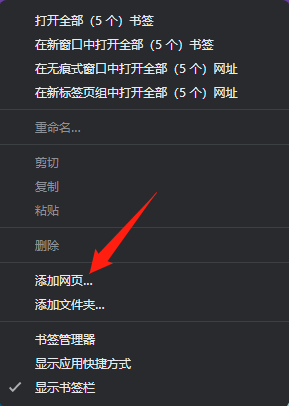
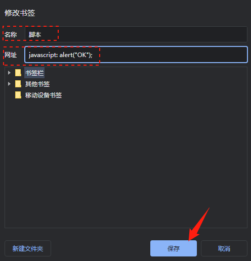

[跳转到脚本列表🚀](#脚本分享)

## 什么是书签栏的脚本？

用过油猴脚本自然不会对书签栏脚本感到陌生，与油猴不同的是，书签栏脚本的触发方式是点击书签，而不会自动触发。以下是演示GIF：


## 使用方式

以Chrome浏览器为例，第一步：右键书签栏，选择添加网页



第二步：在名称处填写脚本名称，**网址**处填写脚本，最后点击保存即可！



## 脚本分享

### 1.页面自动刷新

**功能：** 点击之后输入秒数t（未作限制，请输入数字），页面会自动进行 t 秒一次的刷新，无限循环；如果需要停止，再次单击，点击取消或者输入0即可刷新一次自动取消。

```js
javascript: var t=prompt("Time(s)="); var current = location.href; if (t) {setTimeout('reload()', 1000 * t); function reload() { setTimeout('reload()', 1000 * t); var fr4me = '<frameset cols=\'*\'>\n<frame src=\'' + current + '\' />'; fr4me += '</frameset>'; with (document) { write(fr4me); void (close()); }; };}else{location.replace(current);};
```

### 2. Video自动播放

功能：点击之后输入速度t即可实现视频倍速播放，点击取消或者输入0即可恢复1倍速播放。

```js
javascript: var t=prompt("speed = "); if(t){document.getElementsByTagName("video")[0].playbackRate = t*1;}else{document.getElementsByTagName("video")[0].playbackRate = 1;};
```

