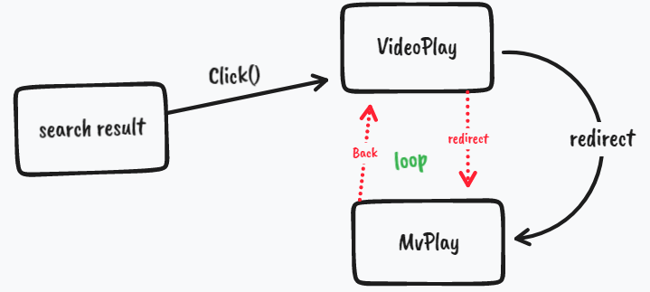

> 重定向后页面回退反复跳转bug

## 问题

在网易云项目时，由于Api所返回数据的问题，在Video搜索界面出现Mv的结果，这样就导致当点击的视频为Mv时，无法在Video页面利用传入的id参数渲染Video



## 解决办法

想到利用判断，在得到MV之后跳转到MV播放界面，也即重定向redirect：

```js
this.$router.push({
  name: 'MvPlay',
  query: {
    id: this.id,
  }
})
```
但是，这就出现了页面回退之后又前进这样反复的BUG，于是想到`replace`，修改为：

```js
this.$router.replace({
  name: 'MvPlay',
  query: {
    id: this.id,
  }
})
```

这样，在Video页面重定向到Mv页面后，不会留下在Video页面的历史，所以就不会出现上面的BUG了！